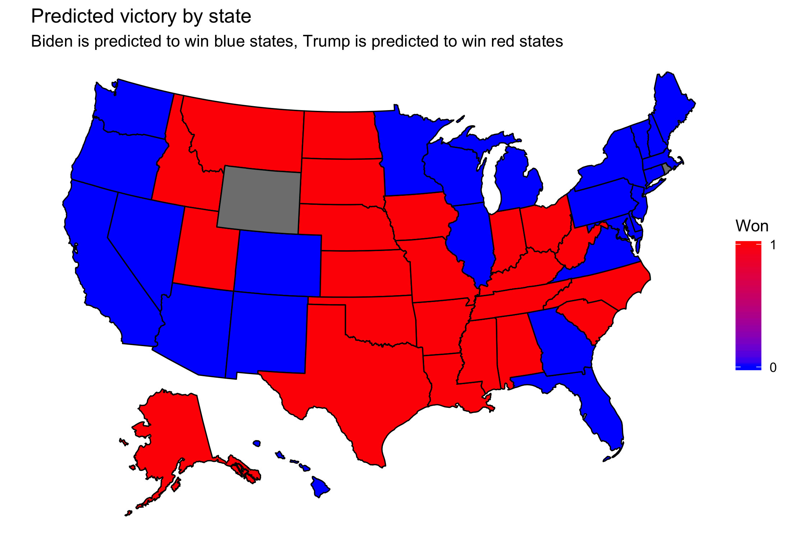

## Post-election reflection
### November 23, 2020

[Back to main page](https://hwsimpson33.github.io/pres2020/)

In order to predict state-level popular vote, I regressed state-level results on previous state-level vote and polls (an average of all the polls in the 30 days before the election that were ranked in the A or B range by 538). I used the coefficients from this regression to predict the results of the 2020 election. This map shows my predictions.[^1] 

[Click here to see full-size image.](https://hwsimpson33.github.io/pres2020/images/won_map_plot.png)

Despite my relatively simple model, I only predicted one state incorrectly (Florida). I was surprised and pleased by this result, which has a relatively high classification accuracy (50/51, if you count the previous vote as my prediction for the three states without polls). My state-level popular vote totals were not as accurate, however. On average, I overpredicted Biden's share of the vote by 3.2%, with errors ranging from 19% too Democrat to 9% too Republican. The six states that I missed by more than 10% were all states where I overestimated Democratic vote share. All of these states were safe Republican and Democratic states, however, so my classification accuracy did not suffer.

<table style="border-collapse:collapse;" class=table_4433 border=2>
<caption>States I missed by more than 10%</caption>
<thead>
<tr>
  <th id="tableHTML_header_1">State</th>
  <th id="tableHTML_header_2">Point prediction (Republican margin)</th>
  <th id="tableHTML_header_3">Result (Republican margin)</th>
  <th id="tableHTML_header_4">Difference</th>
</tr>
</thead>
<tbody>
<tr>
  <td id="tableHTML_column_1">Hawaii</td>
  <td id="tableHTML_column_2">-44.3101</td>
  <td id="tableHTML_column_3">-30.0851</td>
  <td id="tableHTML_column_4">-14.225</td>
</tr>
<tr>
  <td id="tableHTML_column_1">Missouri</td>
  <td id="tableHTML_column_2">5.0454</td>
  <td id="tableHTML_column_3">15.8729</td>
  <td id="tableHTML_column_4">-10.8275</td>
</tr>
<tr>
  <td id="tableHTML_column_1">Montana</td>
  <td id="tableHTML_column_2">2.8581</td>
  <td id="tableHTML_column_3">16.7944</td>
  <td id="tableHTML_column_4">-13.9363</td>
</tr>
<tr>
  <td id="tableHTML_column_1">New York</td>
  <td id="tableHTML_column_2">-31.9772</td>
  <td id="tableHTML_column_3">-12.9458</td>
  <td id="tableHTML_column_4">-19.0314</td>
</tr>
<tr>
  <td id="tableHTML_column_1">North Dakota</td>
  <td id="tableHTML_column_2">22.49</td>
  <td id="tableHTML_column_3">34.4348</td>
  <td id="tableHTML_column_4">-11.9448</td>
</tr>
<tr>
  <td id="tableHTML_column_1">South Dakota</td>
  <td id="tableHTML_column_2">15.0019</td>
  <td id="tableHTML_column_3">26.8696</td>
  <td id="tableHTML_column_4">-11.8677</td>
</tr>
</tbody>
</table>

[Click here to see a table containing results for every state.](https://hwsimpson33.github.io/pres2020/images/results_table.png)

The other major weakness of my model was the large margins of error. Although there were nine states where either a Trump or a Biden victory was within the margin of error, only one of these states flipped in the actual election.[^2] This appears to be a technicality, but in fact it is a major problem with my model. The point prediction is not a very good way of evaluating a model, because the chances that it will be exactly right are almost zero. Instead, models are evaluated by comparing the difference between the point prediction and the true value, scaled by the margin of error. Probabilities of victory are calculated in the same way, by combining a point prediction and a margin of error to get the probability of an outcome more extreme than a 50-50% tie.

So my model was underconfident. In the event, I either got very lucky, and all of the states just happened to go in my direction -- or the uncertainty was incorrectly calibrated, and I actually had more information than I gave myself credit for in the prediction intervals.

There are several reasons why this might have been the case. The first is the inclusion of the previous vote term in my regression, which actually increased uncertainty without increasing predictive power in some states. The second is the small sample size, which leads to large uncertainties and is mainly due to the unpooled model structure I chose. I ran a separate regression for each of the 50 states, but in reality information about the historical accuracy of polls in one state gives you information about the accuracy of polls in other states, so a partial pooling model across states would likely have given me smaller prediction margins with the same dataset. Third, more sophisticated polling aggregation would likely have given me more accurate historical results, and so a smaller prediction margin for 2020. I took an arbitrary standard of quality, the 538 rankings, cut off all polls that didn't meet that standard, and used an arithmetic average of all the remaining polls, which implies they all give roughly the same information about the true nature of the race in each state. Instead, I could have weighted historically more accurate polls more heavily, weighted extreme polls disproportionately more or less, or used "house effects" as The Economist does. These methods may have allowed me to predict the state-level popular vote with more accuracy.

In general, my model appears to have been overly confident in safe states and underconfident in swing states. This result makes sense, because the number of polls in each state is not taken into account by my poll aggregation method. In a state with only one poll, the model treats that single poll as if it gave as much information as every poll combined in a highly contested state. In reality, however, the average of the many polls taken in swing states contains more information, and so should allow for a narrower prediction margin, than the single poll in a safe state. To some extent, my model took care of this variation by treating each state as separate, so that states that historically have been swing states have historically gotten more polls and so (presumably) have more accurate polls and a higher weight on the polling average. This is a very rough way of capturing the disparity in polling between states, however, because the states that are contested change each election and there are better ways of incorporating the amount and quality of polling in each state in this specific election.

In order to test this hypothesis, I would want to look at the relationship between my model's confidence in its prediction of who would win each state (perhaps in the form of a z score) and compare that to the victory margin, early polling results, or the previous vote share in each state (to avoid endogeneity) in order to assess whether my model really was overconfident in safe states and underconfident in swing states. I would then want to compare my model's performance, how uncertain victory was in each state, and the number of polls done in each state to see whether variation in the number of polls conducted explains model confidence and accuracy. This could be done visually, on a scatter plot or heat map, or by running a regression with a measure of model accuracy or uncertainty on the left-hand side and independent variables like how uncertain each state was and the number of polls conducted in each state on the right-hand side. 

In addition to the changes described above, next time I would also want to look in more depth at county-level polling in swing states. Because counties show historical continuity over time, if I could drill down on the polling in contested states to capture the local variation in polling (perhaps using a method like MRP, which allows you to disaggregate polling results by demographic and locality), I would have a better understanding of what is going on in the most important counties in the race.

[^1]: My model did not give predictions for three states (Wyoming, Rhode Island, and Washington, DC), because no polls were conducted in those states during the entire 2020 race. Although it is not represented on the map, I anticipated that Wyoming would go Republican and Rhode Island and DC would go Democrat based on the 2016 results.

[^2]: The nine states were: Arizona, Florida, Georgia, Iowa, Missouri, Montana, Nebraska (taken as a whole), New Hampshire, and North Carolina.

[Back to main page](https://hwsimpson33.github.io/pres2020/)

