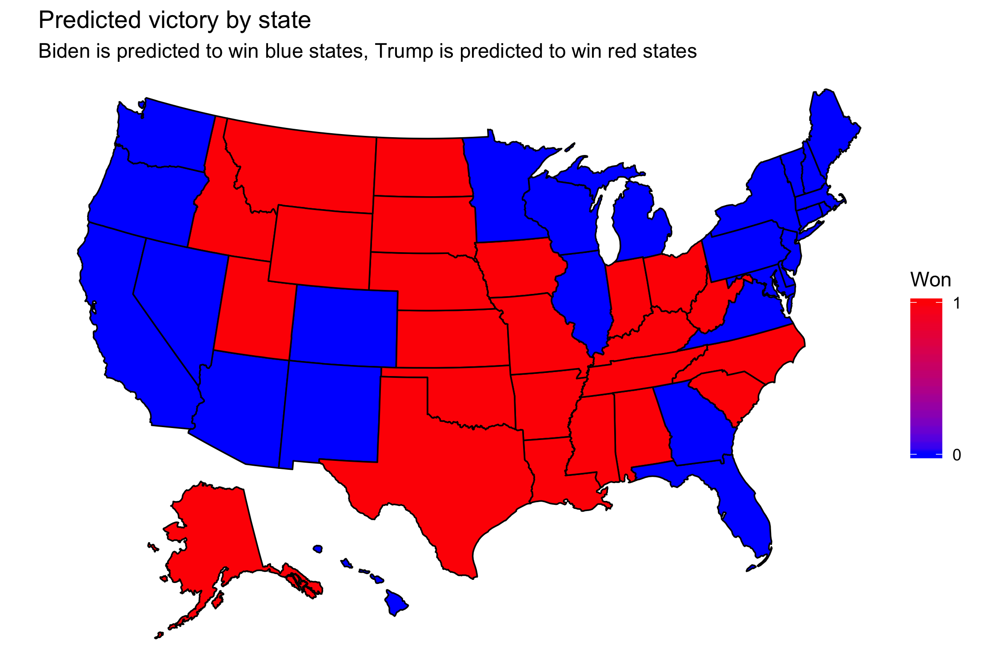
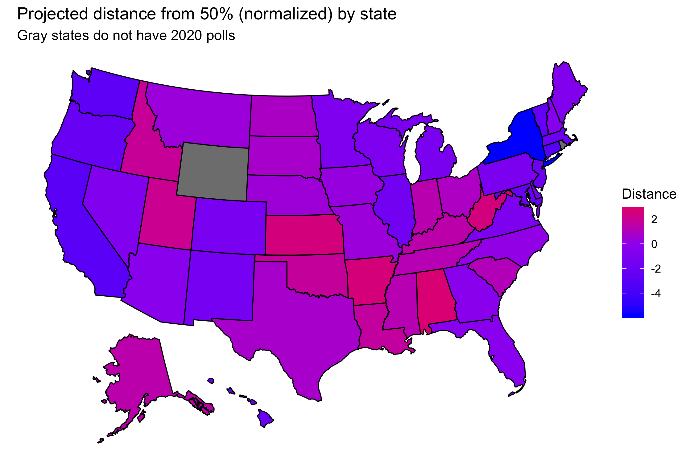

## Final prediction
### November 1, 2020

[Back to main page](https://hwsimpson33.github.io/pres2020/)

I am using a very simple model to predict the 2020 election, but one grounded in political science results and the patterns I have observed in previous weeks. For each state, I have taken the result from the previous presidential election and an average of all high-quality polls (polls rated between B/C and A+ by 538) in the thirty days before the election and used them to predict election results with a linear regression. I chose to use previous vote share because states often show continuity between elections (as I learned in my [Week 1](week1.md) blog post). I am using polls from just before the election because [political science research](https://gking.harvard.edu/files/abs/variable-abs.shtml) has shown that polls are often very accurate in the days leading up to the election. I am not including the so-called "fundamental" variables like economic performance and incumbency or campaign variables like ad spending and field offices because these factors should be "priced in" to the polls at this late stage in the race. In previous weeks, I have not found significant effects for state-level results and the national economy (see [Week 2](week2.md)). I have also found that ad spending does not foreshadow poll movements but TV mentions of candidates' names does (see [Week 5](week5.md)). Therefore, I have decided to focus on two aspects of the presidential race: the polls, which capture the state of the race and previous state-level vote, which sometimes acts as a corrective to the polls.

This model predicts that *Donald Trump* will win between *164* and *263* electoral college votes with 95% probability, with the most likey result that he wins *203* votes. Conversely, *Joe Biden* will win between *275* and *374* votes with 95% probability, with his most likely tally at *335*. Although a Trump victory (for which he needs *270* electoral college votes) is outside the 95% confidence interval of this model, it is very close to the edge of that interval (263 votes for Trump). This model predicts a Biden victory, but there is still a small chance that Trump will win.


[Click here to see full-size image.](https://hwsimpson33.github.io/pres2020/images/won_map_plot.png)

This map shows how "safe" states are predicted to be. The more red a state is, the more confident this model is that the state will vote for Trump. The more blue a state is, the greater the probability it will go for Biden


[Click here to see full-size image.](https://hwsimpson33.github.io/pres2020/images/uncertainty_map_plot.png)

The formula I used was: 

```
state margin for Rep. candidate = previous margin for Rep. candidate + average of state polls in 30 days prior to election

```

I ran fifty separate regressions, one for each state (full results are in the Appendix, table 2). In this model specification, the coefficient on the previous margin represents the amount by which Republican vote margin is expected to increase given a one point increase in the previous Republican vote margin. The coefficient on the state polls average represents the expected increase in Republican vote margin given a one point increase in the amount that the Republican candidate is favored by the poll. 

In order to validate this model, I measured the mean squared error (in-sample fit) and r2. Measuring out-of-sample fit is technically feasible, but the results are not very illuminating for this model because of the large number of regressions. Overall, this model does a fair job of predicting historical election results

There are lots of ways to make this model more complicated. One could use previous county-level results and state-level polls to predict county-level vote share, and then aggregate up to the state level. A sophisticated approach would be to disaggregate state-level polling using county-level demographics and then use these estimates to project county-level vote share. Another way to complicate this model is to aggregate polls in a more complicated way. Both of these ideas require collecting data from the polls themselves, rather than a polling aggregator like 538, and so proved infeasible given the time alloted. For future elections, however, I plan to explore these approaches.

[Back to main page](https://hwsimpson33.github.io/pres2020/)

#Appendix: Model tables

Table 1: Full predictions
<table style="border-collapse:collapse;" class=table_9844 border=2>
<thead>
<tr>
  <th id="tableHTML_header_1">State</th>
  <th id="tableHTML_header_2">Point prediction</th>
  <th id="tableHTML_header_3">Lower bound</th>
  <th id="tableHTML_header_4">Upper bound</th>
</tr>
</thead>
<tbody>
<tr>
  <td id="tableHTML_column_1">Alabama</td>
  <td id="tableHTML_column_2">21.9206</td>
  <td id="tableHTML_column_3">17.9306</td>
  <td id="tableHTML_column_4">25.9106</td>
</tr>
<tr>
  <td id="tableHTML_column_1">Alaska</td>
  <td id="tableHTML_column_2">18.3274</td>
  <td id="tableHTML_column_3">11.742</td>
  <td id="tableHTML_column_4">24.9128</td>
</tr>
<tr>
  <td id="tableHTML_column_1">Arizona</td>
  <td id="tableHTML_column_2">-2.0955</td>
  <td id="tableHTML_column_3">-7.4569</td>
  <td id="tableHTML_column_4">3.266</td>
</tr>
<tr>
  <td id="tableHTML_column_1">Arkansas</td>
  <td id="tableHTML_column_2">36.8509</td>
  <td id="tableHTML_column_3">29.6191</td>
  <td id="tableHTML_column_4">44.0827</td>
</tr>
<tr>
  <td id="tableHTML_column_1">California</td>
  <td id="tableHTML_column_2">-32.6088</td>
  <td id="tableHTML_column_3">-38.0509</td>
  <td id="tableHTML_column_4">-27.1667</td>
</tr>
<tr>
  <td id="tableHTML_column_1">Colorado</td>
  <td id="tableHTML_column_2">-12.3174</td>
  <td id="tableHTML_column_3">-17.4075</td>
  <td id="tableHTML_column_4">-7.2273</td>
</tr>
<tr>
  <td id="tableHTML_column_1">Connecticut</td>
  <td id="tableHTML_column_2">-24.8847</td>
  <td id="tableHTML_column_3">-28.8681</td>
  <td id="tableHTML_column_4">-20.9013</td>
</tr>
<tr>
  <td id="tableHTML_column_1">Delaware</td>
  <td id="tableHTML_column_2">-16.9962</td>
  <td id="tableHTML_column_3">-22.3808</td>
  <td id="tableHTML_column_4">-11.6117</td>
</tr>
<tr>
  <td id="tableHTML_column_1">District of Columbia</td>
  <td id="tableHTML_column_2">-91.3904</td>
  <td id="tableHTML_column_3">NA</td>
  <td id="tableHTML_column_4">NA</td>
</tr>
<tr>
  <td id="tableHTML_column_1">Florida</td>
  <td id="tableHTML_column_2">-1.9009</td>
  <td id="tableHTML_column_3">-5.7258</td>
  <td id="tableHTML_column_4">1.924</td>
</tr>
<tr>
  <td id="tableHTML_column_1">Georgia</td>
  <td id="tableHTML_column_2">-1.1112</td>
  <td id="tableHTML_column_3">-4.1402</td>
  <td id="tableHTML_column_4">1.9177</td>
</tr>
<tr>
  <td id="tableHTML_column_1">Hawaii</td>
  <td id="tableHTML_column_2">-44.3101</td>
  <td id="tableHTML_column_3">-54.2868</td>
  <td id="tableHTML_column_4">-34.3334</td>
</tr>
<tr>
  <td id="tableHTML_column_1">Idaho</td>
  <td id="tableHTML_column_2">31.7868</td>
  <td id="tableHTML_column_3">23.2333</td>
  <td id="tableHTML_column_4">40.3403</td>
</tr>
<tr>
  <td id="tableHTML_column_1">Illinois</td>
  <td id="tableHTML_column_2">-16.0511</td>
  <td id="tableHTML_column_3">-20.9296</td>
  <td id="tableHTML_column_4">-11.1727</td>
</tr>
<tr>
  <td id="tableHTML_column_1">Indiana</td>
  <td id="tableHTML_column_2">12.4095</td>
  <td id="tableHTML_column_3">7.7011</td>
  <td id="tableHTML_column_4">17.1178</td>
</tr>
<tr>
  <td id="tableHTML_column_1">Iowa</td>
  <td id="tableHTML_column_2">2.662</td>
  <td id="tableHTML_column_3">-2.1048</td>
  <td id="tableHTML_column_4">7.4287</td>
</tr>
<tr>
  <td id="tableHTML_column_1">Kansas</td>
  <td id="tableHTML_column_2">15.5149</td>
  <td id="tableHTML_column_3">12.4522</td>
  <td id="tableHTML_column_4">18.5777</td>
</tr>
<tr>
  <td id="tableHTML_column_1">Kentucky</td>
  <td id="tableHTML_column_2">26.2653</td>
  <td id="tableHTML_column_3">17.0039</td>
  <td id="tableHTML_column_4">35.5267</td>
</tr>
<tr>
  <td id="tableHTML_column_1">Louisiana</td>
  <td id="tableHTML_column_2">27.8796</td>
  <td id="tableHTML_column_3">19.6197</td>
  <td id="tableHTML_column_4">36.1394</td>
</tr>
<tr>
  <td id="tableHTML_column_1">Maine</td>
  <td id="tableHTML_column_2">-17.6871</td>
  <td id="tableHTML_column_3">-29.087</td>
  <td id="tableHTML_column_4">-6.2872</td>
</tr>
<tr>
  <td id="tableHTML_column_1">Maryland</td>
  <td id="tableHTML_column_2">-27.0475</td>
  <td id="tableHTML_column_3">-33.4209</td>
  <td id="tableHTML_column_4">-20.6741</td>
</tr>
<tr>
  <td id="tableHTML_column_1">Massachusetts</td>
  <td id="tableHTML_column_2">-36.7493</td>
  <td id="tableHTML_column_3">-45.6899</td>
  <td id="tableHTML_column_4">-27.8086</td>
</tr>
<tr>
  <td id="tableHTML_column_1">Michigan</td>
  <td id="tableHTML_column_2">-8.21</td>
  <td id="tableHTML_column_3">-11.7378</td>
  <td id="tableHTML_column_4">-4.6822</td>
</tr>
<tr>
  <td id="tableHTML_column_1">Minnesota</td>
  <td id="tableHTML_column_2">-9.0042</td>
  <td id="tableHTML_column_3">-13.9381</td>
  <td id="tableHTML_column_4">-4.0703</td>
</tr>
<tr>
  <td id="tableHTML_column_1">Mississippi</td>
  <td id="tableHTML_column_2">15.8242</td>
  <td id="tableHTML_column_3">9.5142</td>
  <td id="tableHTML_column_4">22.1342</td>
</tr>
<tr>
  <td id="tableHTML_column_1">Missouri</td>
  <td id="tableHTML_column_2">5.0454</td>
  <td id="tableHTML_column_3">-1.5984</td>
  <td id="tableHTML_column_4">11.6892</td>
</tr>
<tr>
  <td id="tableHTML_column_1">Montana</td>
  <td id="tableHTML_column_2">2.8581</td>
  <td id="tableHTML_column_3">-1.2768</td>
  <td id="tableHTML_column_4">6.9929</td>
</tr>
<tr>
  <td id="tableHTML_column_1">Nebraska</td>
  <td id="tableHTML_column_2">9.642</td>
  <td id="tableHTML_column_3">-1.8754</td>
  <td id="tableHTML_column_4">21.1594</td>
</tr>
<tr>
  <td id="tableHTML_column_1">Nevada</td>
  <td id="tableHTML_column_2">-11.6623</td>
  <td id="tableHTML_column_3">-19.2428</td>
  <td id="tableHTML_column_4">-4.0817</td>
</tr>
<tr>
  <td id="tableHTML_column_1">New Hampshire</td>
  <td id="tableHTML_column_2">-8.087</td>
  <td id="tableHTML_column_3">-20.756</td>
  <td id="tableHTML_column_4">4.582</td>
</tr>
<tr>
  <td id="tableHTML_column_1">New Jersey</td>
  <td id="tableHTML_column_2">-24.1546</td>
  <td id="tableHTML_column_3">-30.5625</td>
  <td id="tableHTML_column_4">-17.7468</td>
</tr>
<tr>
  <td id="tableHTML_column_1">New Mexico</td>
  <td id="tableHTML_column_2">-13.5394</td>
  <td id="tableHTML_column_3">-18.3251</td>
  <td id="tableHTML_column_4">-8.7537</td>
</tr>
<tr>
  <td id="tableHTML_column_1">New York</td>
  <td id="tableHTML_column_2">-31.9772</td>
  <td id="tableHTML_column_3">-34.7415</td>
  <td id="tableHTML_column_4">-29.213</td>
</tr>
<tr>
  <td id="tableHTML_column_1">North Carolina</td>
  <td id="tableHTML_column_2">1.2296</td>
  <td id="tableHTML_column_3">-3.286</td>
  <td id="tableHTML_column_4">5.7453</td>
</tr>
<tr>
  <td id="tableHTML_column_1">North Dakota</td>
  <td id="tableHTML_column_2">22.49</td>
  <td id="tableHTML_column_3">8.8546</td>
  <td id="tableHTML_column_4">36.1254</td>
</tr>
<tr>
  <td id="tableHTML_column_1">Ohio</td>
  <td id="tableHTML_column_2">4.2218</td>
  <td id="tableHTML_column_3">1.8641</td>
  <td id="tableHTML_column_4">6.5795</td>
</tr>
<tr>
  <td id="tableHTML_column_1">Oklahoma</td>
  <td id="tableHTML_column_2">25.4681</td>
  <td id="tableHTML_column_3">18.3076</td>
  <td id="tableHTML_column_4">32.6286</td>
</tr>
<tr>
  <td id="tableHTML_column_1">Oregon</td>
  <td id="tableHTML_column_2">-16.6433</td>
  <td id="tableHTML_column_3">-20.3242</td>
  <td id="tableHTML_column_4">-12.9624</td>
</tr>
<tr>
  <td id="tableHTML_column_1">Pennsylvania</td>
  <td id="tableHTML_column_2">-6.7752</td>
  <td id="tableHTML_column_3">-10.1509</td>
  <td id="tableHTML_column_4">-3.3996</td>
</tr>
<tr>
  <td id="tableHTML_column_1">Rhode Island</td>
  <td id="tableHTML_column_2">-16.6214</td>
  <td id="tableHTML_column_3">NA</td>
  <td id="tableHTML_column_4">NA</td>
</tr>
<tr>
  <td id="tableHTML_column_1">South Carolina</td>
  <td id="tableHTML_column_2">9.8522</td>
  <td id="tableHTML_column_3">5.3622</td>
  <td id="tableHTML_column_4">14.3422</td>
</tr>
<tr>
  <td id="tableHTML_column_1">South Dakota</td>
  <td id="tableHTML_column_2">15.0019</td>
  <td id="tableHTML_column_3">4.3802</td>
  <td id="tableHTML_column_4">25.6235</td>
</tr>
<tr>
  <td id="tableHTML_column_1">Tennessee</td>
  <td id="tableHTML_column_2">22.0115</td>
  <td id="tableHTML_column_3">13.0487</td>
  <td id="tableHTML_column_4">30.9744</td>
</tr>
<tr>
  <td id="tableHTML_column_1">Texas</td>
  <td id="tableHTML_column_2">6.0978</td>
  <td id="tableHTML_column_3">1.7412</td>
  <td id="tableHTML_column_4">10.4544</td>
</tr>
<tr>
  <td id="tableHTML_column_1">Utah</td>
  <td id="tableHTML_column_2">23.1254</td>
  <td id="tableHTML_column_3">17.4026</td>
  <td id="tableHTML_column_4">28.8481</td>
</tr>
<tr>
  <td id="tableHTML_column_1">Vermont</td>
  <td id="tableHTML_column_2">-31.0238</td>
  <td id="tableHTML_column_3">-37.1263</td>
  <td id="tableHTML_column_4">-24.9213</td>
</tr>
<tr>
  <td id="tableHTML_column_1">Virginia</td>
  <td id="tableHTML_column_2">-10.9369</td>
  <td id="tableHTML_column_3">-16.8387</td>
  <td id="tableHTML_column_4">-5.0351</td>
</tr>
<tr>
  <td id="tableHTML_column_1">Washington</td>
  <td id="tableHTML_column_2">-25.0204</td>
  <td id="tableHTML_column_3">-29.4365</td>
  <td id="tableHTML_column_4">-20.6042</td>
</tr>
<tr>
  <td id="tableHTML_column_1">West Virginia</td>
  <td id="tableHTML_column_2">42.0839</td>
  <td id="tableHTML_column_3">33.5751</td>
  <td id="tableHTML_column_4">50.5926</td>
</tr>
<tr>
  <td id="tableHTML_column_1">Wisconsin</td>
  <td id="tableHTML_column_2">-7.8144</td>
  <td id="tableHTML_column_3">-12.1085</td>
  <td id="tableHTML_column_4">-3.5203</td>
</tr>
<tr>
  <td id="tableHTML_column_1">Wyoming</td>
  <td id="tableHTML_column_2">51.4106</td>
  <td id="tableHTML_column_3">NA</td>
  <td id="tableHTML_column_4">NA</td>
</tr>
</tbody>
</table>

Table 2: Regression results
<table style="border-collapse:collapse;" class=table_9844 border=2>
<thead>
<tr>
  <th id="tableHTML_header_1">State</th>
  <th id="tableHTML_header_2">Term</th>
  <th id="tableHTML_header_3">Estimate</th>
  <th id="tableHTML_header_4">Std. error</th>
  <th id="tableHTML_header_4">p value</th>
</tr>
</thead>
<tbody>
<tr>
<td id="tableHTML_column_1">Arkansas</td>
  <td id="tableHTML_column_2">Republican lead in last 30 days</td>
  <td id="tableHTML_column_3">1.1393</td>
  <td id="tableHTML_column_4">0.117</td>
  <td id="tableHTML_column_5">1e-04</td>
</tr>
<tr>
  <td id="tableHTML_column_1">Arkansas</td>
  <td id="tableHTML_column_2">Republican win/loss margin in previous election</td>
  <td id="tableHTML_column_3">0.0536</td>
  <td id="tableHTML_column_4">0.082</td>
  <td id="tableHTML_column_5">0.5378</td>
</tr>
<tr>
  <td id="tableHTML_column_1">California</td>
  <td id="tableHTML_column_2">Intercept</td>
  <td id="tableHTML_column_3">-0.6106</td>
  <td id="tableHTML_column_4">1.1788</td>
  <td id="tableHTML_column_5">0.617</td>
</tr>
<tr>
  <td id="tableHTML_column_1">California</td>
  <td id="tableHTML_column_2">Republican lead in last 30 days</td>
  <td id="tableHTML_column_3">1.0821</td>
  <td id="tableHTML_column_4">0.1209</td>
  <td id="tableHTML_column_5">0</td>
</tr>
<tr>
  <td id="tableHTML_column_1">California</td>
  <td id="tableHTML_column_2">Republican win/loss margin in previous election</td>
  <td id="tableHTML_column_3">0.1198</td>
  <td id="tableHTML_column_4">0.1123</td>
  <td id="tableHTML_column_5">0.3137</td>
</tr>
<tr>
  <td id="tableHTML_column_1">Colorado</td>
  <td id="tableHTML_column_2">Intercept</td>
  <td id="tableHTML_column_3">-0.2771</td>
  <td id="tableHTML_column_4">1.509</td>
  <td id="tableHTML_column_5">0.8584</td>
</tr>
<tr>
  <td id="tableHTML_column_1">Colorado</td>
  <td id="tableHTML_column_2">Republican lead in last 30 days</td>
  <td id="tableHTML_column_3">0.7757</td>
  <td id="tableHTML_column_4">0.0883</td>
  <td id="tableHTML_column_5">0</td>
</tr>
<tr>
  <td id="tableHTML_column_1">Colorado</td>
  <td id="tableHTML_column_2">Republican win/loss margin in previous election</td>
  <td id="tableHTML_column_3">0.3885</td>
  <td id="tableHTML_column_4">0.0962</td>
  <td id="tableHTML_column_5">0.0029</td>
</tr>
<tr>
  <td id="tableHTML_column_1">Connecticut</td>
  <td id="tableHTML_column_2">Intercept</td>
  <td id="tableHTML_column_3">-0.8902</td>
  <td id="tableHTML_column_4">1.0428</td>
  <td id="tableHTML_column_5">0.4155</td>
</tr>
<tr>
  <td id="tableHTML_column_1">Connecticut</td>
  <td id="tableHTML_column_2">Republican lead in last 30 days</td>
  <td id="tableHTML_column_3">0.7639</td>
  <td id="tableHTML_column_4">0.0714</td>
  <td id="tableHTML_column_5">0</td>
</tr>
<tr>
  <td id="tableHTML_column_1">Connecticut</td>
  <td id="tableHTML_column_2">Republican win/loss margin in previous election</td>
  <td id="tableHTML_column_3">0.3429</td>
  <td id="tableHTML_column_4">0.0751</td>
  <td id="tableHTML_column_5">0.0014</td>
</tr>
<tr>
  <td id="tableHTML_column_1">Delaware</td>
  <td id="tableHTML_column_2">Intercept</td>
  <td id="tableHTML_column_3">-3.8481</td>
  <td id="tableHTML_column_4">1.8375</td>
  <td id="tableHTML_column_5">0.0811</td>
</tr>
<tr>
  <td id="tableHTML_column_1">Delaware</td>
  <td id="tableHTML_column_2">Republican lead in last 30 days</td>
  <td id="tableHTML_column_3">0.9607</td>
  <td id="tableHTML_column_4">0.2035</td>
  <td id="tableHTML_column_5">0.0033</td>
</tr>
<tr>
  <td id="tableHTML_column_1">Delaware</td>
  <td id="tableHTML_column_2">Republican win/loss margin in previous election</td>
  <td id="tableHTML_column_3">0.0494</td>
  <td id="tableHTML_column_4">0.1314</td>
  <td id="tableHTML_column_5">0.72</td>
</tr>
<tr>
  <td id="tableHTML_column_1">District of Columbia</td>
  <td id="tableHTML_column_2">Intercept</td>
  <td id="tableHTML_column_3">-58.2097</td>
  <td id="tableHTML_column_4">39.1371</td>
  <td id="tableHTML_column_5">0.2753</td>
</tr>
<tr>
  <td id="tableHTML_column_1">District of Columbia</td>
  <td id="tableHTML_column_2">Republican lead in last 30 days</td>
  <td id="tableHTML_column_3">0.1925</td>
  <td id="tableHTML_column_4">0.3611</td>
  <td id="tableHTML_column_5">0.6473</td>
</tr>
<tr>
  <td id="tableHTML_column_1">District of Columbia</td>
  <td id="tableHTML_column_2">Republican win/loss margin in previous election</td>
  <td id="tableHTML_column_3">0.1486</td>
  <td id="tableHTML_column_4">0.7209</td>
  <td id="tableHTML_column_5">0.8557</td>
</tr>
<tr>
  <td id="tableHTML_column_1">Florida</td>
  <td id="tableHTML_column_2">Intercept</td>
  <td id="tableHTML_column_3">1.8446</td>
  <td id="tableHTML_column_4">1.4534</td>
  <td id="tableHTML_column_5">0.245</td>
</tr>
<tr>
  <td id="tableHTML_column_1">Florida</td>
  <td id="tableHTML_column_2">Republican lead in last 30 days</td>
  <td id="tableHTML_column_3">1.3301</td>
  <td id="tableHTML_column_4">0.1782</td>
  <td id="tableHTML_column_5">1e-04</td>
</tr>
<tr>
  <td id="tableHTML_column_1">Florida</td>
  <td id="tableHTML_column_2">Republican win/loss margin in previous election</td>
  <td id="tableHTML_column_3">-0.2142</td>
  <td id="tableHTML_column_4">0.1408</td>
  <td id="tableHTML_column_5">0.172</td>
</tr>
<tr>
  <td id="tableHTML_column_1">Georgia</td>
  <td id="tableHTML_column_2">Intercept</td>
  <td id="tableHTML_column_3">0.6051</td>
  <td id="tableHTML_column_4">1.3717</td>
  <td id="tableHTML_column_5">0.6724</td>
</tr>
<tr>
  <td id="tableHTML_column_1">Georgia</td>
  <td id="tableHTML_column_2">Republican lead in last 30 days</td>
  <td id="tableHTML_column_3">1.1619</td>
  <td id="tableHTML_column_4">0.0968</td>
  <td id="tableHTML_column_5">0</td>
</tr>
<tr>
  <td id="tableHTML_column_1">Georgia</td>
  <td id="tableHTML_column_2">Republican win/loss margin in previous election</td>
  <td id="tableHTML_column_3">0.0102</td>
  <td id="tableHTML_column_4">0.0616</td>
  <td id="tableHTML_column_5">0.8726</td>
</tr>
<tr>
  <td id="tableHTML_column_1">Hawaii</td>
  <td id="tableHTML_column_2">Intercept</td>
  <td id="tableHTML_column_3">3.8651</td>
  <td id="tableHTML_column_4">4.8515</td>
  <td id="tableHTML_column_5">0.456</td>
</tr>
<tr>
  <td id="tableHTML_column_1">Hawaii</td>
  <td id="tableHTML_column_2">Republican lead in last 30 days</td>
  <td id="tableHTML_column_3">1.5246</td>
  <td id="tableHTML_column_4">0.3087</td>
  <td id="tableHTML_column_5">0.0026</td>
</tr>
<tr>
  <td id="tableHTML_column_1">Hawaii</td>
  <td id="tableHTML_column_2">Republican win/loss margin in previous election</td>
  <td id="tableHTML_column_3">0.0699</td>
  <td id="tableHTML_column_4">0.1518</td>
  <td id="tableHTML_column_5">0.6614</td>
</tr>
<tr>
  <td id="tableHTML_column_1">Idaho</td>
  <td id="tableHTML_column_2">Intercept</td>
  <td id="tableHTML_column_3">19.8745</td>
  <td id="tableHTML_column_4">12.9425</td>
  <td id="tableHTML_column_5">0.1755</td>
</tr>
<tr>
  <td id="tableHTML_column_1">Idaho</td>
  <td id="tableHTML_column_2">Republican lead in last 30 days</td>
  <td id="tableHTML_column_3">0.6523</td>
  <td id="tableHTML_column_4">0.3199</td>
  <td id="tableHTML_column_5">0.0876</td>
</tr>
<tr>
  <td id="tableHTML_column_1">Idaho</td>
  <td id="tableHTML_column_2">Republican win/loss margin in previous election</td>
  <td id="tableHTML_column_3">-0.1232</td>
  <td id="tableHTML_column_4">0.3311</td>
  <td id="tableHTML_column_5">0.7226</td>
</tr>
<tr>
  <td id="tableHTML_column_1">Illinois</td>
  <td id="tableHTML_column_2">Intercept</td>
  <td id="tableHTML_column_3">-1.5205</td>
  <td id="tableHTML_column_4">1.6357</td>
  <td id="tableHTML_column_5">0.3768</td>
</tr>
<tr>
  <td id="tableHTML_column_1">Illinois</td>
  <td id="tableHTML_column_2">Republican lead in last 30 days</td>
  <td id="tableHTML_column_3">0.748</td>
  <td id="tableHTML_column_4">0.1296</td>
  <td id="tableHTML_column_5">3e-04</td>
</tr>
<tr>
  <td id="tableHTML_column_1">Illinois</td>
  <td id="tableHTML_column_2">Republican win/loss margin in previous election</td>
  <td id="tableHTML_column_3">0.2623</td>
  <td id="tableHTML_column_4">0.1365</td>
  <td id="tableHTML_column_5">0.0869</td>
</tr>
<tr>
  <td id="tableHTML_column_1">Indiana</td>
  <td id="tableHTML_column_2">Intercept</td>
  <td id="tableHTML_column_3">0.5944</td>
  <td id="tableHTML_column_4">5.254</td>
  <td id="tableHTML_column_5">0.9131</td>
</tr>
<tr>
  <td id="tableHTML_column_1">Indiana</td>
  <td id="tableHTML_column_2">Republican lead in last 30 days</td>
  <td id="tableHTML_column_3">0.9446</td>
  <td id="tableHTML_column_4">0.2751</td>
  <td id="tableHTML_column_5">0.0109</td>
</tr>
<tr>
  <td id="tableHTML_column_1">Indiana</td>
  <td id="tableHTML_column_2">Republican win/loss margin in previous election</td>
  <td id="tableHTML_column_3">0.2571</td>
  <td id="tableHTML_column_4">0.2102</td>
  <td id="tableHTML_column_5">0.2609</td>
</tr>
<tr>
  <td id="tableHTML_column_1">Iowa</td>
  <td id="tableHTML_column_2">Intercept</td>
  <td id="tableHTML_column_3">1.1237</td>
  <td id="tableHTML_column_4">1.4279</td>
  <td id="tableHTML_column_5">0.454</td>
</tr>
<tr>
  <td id="tableHTML_column_1">Iowa</td>
  <td id="tableHTML_column_2">Republican lead in last 30 days</td>
  <td id="tableHTML_column_3">0.8076</td>
  <td id="tableHTML_column_4">0.1551</td>
  <td id="tableHTML_column_5">8e-04</td>
</tr>
<tr>
  <td id="tableHTML_column_1">Iowa</td>
  <td id="tableHTML_column_2">Republican win/loss margin in previous election</td>
  <td id="tableHTML_column_3">0.1474</td>
  <td id="tableHTML_column_4">0.1454</td>
  <td id="tableHTML_column_5">0.3404</td>
</tr>
<tr>
  <td id="tableHTML_column_1">Kansas</td>
  <td id="tableHTML_column_2">Intercept</td>
  <td id="tableHTML_column_3">10.7463</td>
  <td id="tableHTML_column_4">3.4901</td>
  <td id="tableHTML_column_5">0.0132</td>
</tr>
<tr>
  <td id="tableHTML_column_1">Kansas</td>
  <td id="tableHTML_column_2">Republican lead in last 30 days</td>
  <td id="tableHTML_column_3">0.7431</td>
  <td id="tableHTML_column_4">0.0996</td>
  <td id="tableHTML_column_5">0</td>
</tr>
<tr>
  <td id="tableHTML_column_1">Kansas</td>
  <td id="tableHTML_column_2">Republican win/loss margin in previous election</td>
  <td id="tableHTML_column_3">-0.1031</td>
  <td id="tableHTML_column_4">0.1222</td>
  <td id="tableHTML_column_5">0.421</td>
</tr>
<tr>
  <td id="tableHTML_column_1">Kentucky</td>
  <td id="tableHTML_column_2">Intercept</td>
  <td id="tableHTML_column_3">2.7335</td>
  <td id="tableHTML_column_4">2.9749</td>
  <td id="tableHTML_column_5">0.3887</td>
</tr>
<tr>
  <td id="tableHTML_column_1">Kentucky</td>
  <td id="tableHTML_column_2">Republican lead in last 30 days</td>
  <td id="tableHTML_column_3">0.9793</td>
  <td id="tableHTML_column_4">0.1706</td>
  <td id="tableHTML_column_5">7e-04</td>
</tr>
<tr>
  <td id="tableHTML_column_1">Kentucky</td>
  <td id="tableHTML_column_2">Republican win/loss margin in previous election</td>
  <td id="tableHTML_column_3">0.2196</td>
  <td id="tableHTML_column_4">0.1801</td>
  <td id="tableHTML_column_5">0.2621</td>
</tr>
<tr>
  <td id="tableHTML_column_1">Louisiana</td>
  <td id="tableHTML_column_2">Intercept</td>
  <td id="tableHTML_column_3">-1.5876</td>
  <td id="tableHTML_column_4">2.2113</td>
  <td id="tableHTML_column_5">0.4998</td>
</tr>
<tr>
  <td id="tableHTML_column_1">Louisiana</td>
  <td id="tableHTML_column_2">Republican lead in last 30 days</td>
  <td id="tableHTML_column_3">1.1365</td>
  <td id="tableHTML_column_4">0.2138</td>
  <td id="tableHTML_column_5">0.0018</td>
</tr>
<tr>
  <td id="tableHTML_column_1">Louisiana</td>
  <td id="tableHTML_column_2">Republican win/loss margin in previous election</td>
  <td id="tableHTML_column_3">0.1691</td>
  <td id="tableHTML_column_4">0.1419</td>
  <td id="tableHTML_column_5">0.2783</td>
</tr>
<tr>
  <td id="tableHTML_column_1">Maine</td>
  <td id="tableHTML_column_2">Intercept</td>
  <td id="tableHTML_column_3">2.9667</td>
  <td id="tableHTML_column_4">4.4593</td>
  <td id="tableHTML_column_5">0.5272</td>
</tr>
<tr>
  <td id="tableHTML_column_1">Maine</td>
  <td id="tableHTML_column_2">Republican lead in last 30 days</td>
  <td id="tableHTML_column_3">1.5711</td>
  <td id="tableHTML_column_4">0.6371</td>
  <td id="tableHTML_column_5">0.0431</td>
</tr>
<tr>
  <td id="tableHTML_column_1">Maine</td>
  <td id="tableHTML_column_2">Republican win/loss margin in previous election</td>
  <td id="tableHTML_column_3">0.0717</td>
  <td id="tableHTML_column_4">0.1921</td>
  <td id="tableHTML_column_5">0.7201</td>
</tr>
<tr>
  <td id="tableHTML_column_1">Maryland</td>
  <td id="tableHTML_column_2">Intercept</td>
  <td id="tableHTML_column_3">-3.9466</td>
  <td id="tableHTML_column_4">2.1122</td>
  <td id="tableHTML_column_5">0.0986</td>
</tr>
<tr>
  <td id="tableHTML_column_1">Maryland</td>
  <td id="tableHTML_column_2">Republican lead in last 30 days</td>
  <td id="tableHTML_column_3">0.7637</td>
  <td id="tableHTML_column_4">0.1681</td>
  <td id="tableHTML_column_5">0.0019</td>
</tr>
<tr>
  <td id="tableHTML_column_1">Maryland</td>
  <td id="tableHTML_column_2">Republican win/loss margin in previous election</td>
  <td id="tableHTML_column_3">0.1402</td>
  <td id="tableHTML_column_4">0.1351</td>
  <td id="tableHTML_column_5">0.3296</td>
</tr>
<tr>
  <td id="tableHTML_column_1">Massachusetts</td>
  <td id="tableHTML_column_2">Intercept</td>
  <td id="tableHTML_column_3">-7.0869</td>
  <td id="tableHTML_column_4">3.6383</td>
  <td id="tableHTML_column_5">0.0833</td>
</tr>
<tr>
  <td id="tableHTML_column_1">Massachusetts</td>
  <td id="tableHTML_column_2">Republican lead in last 30 days</td>
  <td id="tableHTML_column_3">0.7742</td>
  <td id="tableHTML_column_4">0.1936</td>
  <td id="tableHTML_column_5">0.0031</td>
</tr>
<tr>
  <td id="tableHTML_column_1">Massachusetts</td>
  <td id="tableHTML_column_2">Republican win/loss margin in previous election</td>
  <td id="tableHTML_column_3">0.0876</td>
  <td id="tableHTML_column_4">0.2014</td>
  <td id="tableHTML_column_5">0.674</td>
</tr>
<tr>
  <td id="tableHTML_column_1">Michigan</td>
  <td id="tableHTML_column_2">Intercept</td>
  <td id="tableHTML_column_3">-0.2648</td>
  <td id="tableHTML_column_4">1.1931</td>
  <td id="tableHTML_column_5">0.8299</td>
</tr>
<tr>
  <td id="tableHTML_column_1">Michigan</td>
  <td id="tableHTML_column_2">Republican lead in last 30 days</td>
  <td id="tableHTML_column_3">0.929</td>
  <td id="tableHTML_column_4">0.1331</td>
  <td id="tableHTML_column_5">1e-04</td>
</tr>
<tr>
  <td id="tableHTML_column_1">Michigan</td>
  <td id="tableHTML_column_2">Republican win/loss margin in previous election</td>
  <td id="tableHTML_column_3">0.188</td>
  <td id="tableHTML_column_4">0.1056</td>
  <td id="tableHTML_column_5">0.1129</td>
</tr>
<tr>
  <td id="tableHTML_column_1">Minnesota</td>
  <td id="tableHTML_column_2">Intercept</td>
  <td id="tableHTML_column_3">-5.4034</td>
  <td id="tableHTML_column_4">2.6049</td>
  <td id="tableHTML_column_5">0.0679</td>
</tr>
<tr>
  <td id="tableHTML_column_1">Minnesota</td>
  <td id="tableHTML_column_2">Republican lead in last 30 days</td>
  <td id="tableHTML_column_3">0.422</td>
  <td id="tableHTML_column_4">0.152</td>
  <td id="tableHTML_column_5">0.0215</td>
</tr>
<tr>
  <td id="tableHTML_column_1">Minnesota</td>
  <td id="tableHTML_column_2">Republican win/loss margin in previous election</td>
  <td id="tableHTML_column_3">-0.0339</td>
  <td id="tableHTML_column_4">0.2453</td>
  <td id="tableHTML_column_5">0.8933</td>
</tr>
<tr>
  <td id="tableHTML_column_1">Mississippi</td>
  <td id="tableHTML_column_2">Intercept</td>
  <td id="tableHTML_column_3">1.6051</td>
  <td id="tableHTML_column_4">5.9381</td>
  <td id="tableHTML_column_5">0.7977</td>
</tr>
<tr>
  <td id="tableHTML_column_1">Mississippi</td>
  <td id="tableHTML_column_2">Republican lead in last 30 days</td>
  <td id="tableHTML_column_3">0.4269</td>
  <td id="tableHTML_column_4">0.3502</td>
  <td id="tableHTML_column_5">0.2773</td>
</tr>
<tr>
  <td id="tableHTML_column_1">Mississippi</td>
  <td id="tableHTML_column_2">Republican win/loss margin in previous election</td>
  <td id="tableHTML_column_3">0.4534</td>
  <td id="tableHTML_column_4">0.2549</td>
  <td id="tableHTML_column_5">0.1354</td>
</tr>
<tr>
  <td id="tableHTML_column_1">Missouri</td>
  <td id="tableHTML_column_2">Intercept</td>
  <td id="tableHTML_column_3">2.1055</td>
  <td id="tableHTML_column_4">1.8817</td>
  <td id="tableHTML_column_5">0.2922</td>
</tr>
<tr>
  <td id="tableHTML_column_1">Missouri</td>
  <td id="tableHTML_column_2">Republican lead in last 30 days</td>
  <td id="tableHTML_column_3">0.702</td>
  <td id="tableHTML_column_4">0.1173</td>
  <td id="tableHTML_column_5">2e-04</td>
</tr>
<tr>
  <td id="tableHTML_column_1">Missouri</td>
  <td id="tableHTML_column_2">Republican win/loss margin in previous election</td>
  <td id="tableHTML_column_3">-0.0233</td>
  <td id="tableHTML_column_4">0.1608</td>
  <td id="tableHTML_column_5">0.8879</td>
</tr>
<tr>
  <td id="tableHTML_column_1">Montana</td>
  <td id="tableHTML_column_2">Intercept</td>
  <td id="tableHTML_column_3">2.4739</td>
  <td id="tableHTML_column_4">1.5894</td>
  <td id="tableHTML_column_5">0.1803</td>
</tr>
<tr>
  <td id="tableHTML_column_1">Montana</td>
  <td id="tableHTML_column_2">Republican lead in last 30 days</td>
  <td id="tableHTML_column_3">1.3081</td>
  <td id="tableHTML_column_4">0.1209</td>
  <td id="tableHTML_column_5">1e-04</td>
</tr>
<tr>
  <td id="tableHTML_column_1">Montana</td>
  <td id="tableHTML_column_2">Republican win/loss margin in previous election</td>
  <td id="tableHTML_column_3">-0.3679</td>
  <td id="tableHTML_column_4">0.0993</td>
  <td id="tableHTML_column_5">0.0139</td>
</tr>
<tr>
  <td id="tableHTML_column_1">Nebraska</td>
  <td id="tableHTML_column_2">Intercept</td>
  <td id="tableHTML_column_3">11.6138</td>
  <td id="tableHTML_column_4">7.0689</td>
  <td id="tableHTML_column_5">0.139</td>
</tr>
<tr>
  <td id="tableHTML_column_1">Nebraska</td>
  <td id="tableHTML_column_2">Republican lead in last 30 days</td>
  <td id="tableHTML_column_3">0.7904</td>
  <td id="tableHTML_column_4">0.2082</td>
  <td id="tableHTML_column_5">0.0053</td>
</tr>
<tr>
  <td id="tableHTML_column_1">Nebraska</td>
  <td id="tableHTML_column_2">Republican win/loss margin in previous election</td>
  <td id="tableHTML_column_3">0.0031</td>
  <td id="tableHTML_column_4">0.1922</td>
  <td id="tableHTML_column_5">0.9877</td>
</tr>
<tr>
  <td id="tableHTML_column_1">Nevada</td>
  <td id="tableHTML_column_2">Intercept</td>
  <td id="tableHTML_column_3">-2.1365</td>
  <td id="tableHTML_column_4">2.2982</td>
  <td id="tableHTML_column_5">0.3884</td>
</tr>
<tr>
  <td id="tableHTML_column_1">Nevada</td>
  <td id="tableHTML_column_2">Republican lead in last 30 days</td>
  <td id="tableHTML_column_3">1.6682</td>
  <td id="tableHTML_column_4">0.2599</td>
  <td id="tableHTML_column_5">7e-04</td>
</tr>
<tr>
  <td id="tableHTML_column_1">Nevada</td>
  <td id="tableHTML_column_2">Republican win/loss margin in previous election</td>
  <td id="tableHTML_column_3">-0.0257</td>
  <td id="tableHTML_column_4">0.1647</td>
  <td id="tableHTML_column_5">0.8813</td>
</tr>
<tr>
  <td id="tableHTML_column_1">New Hampshire</td>
  <td id="tableHTML_column_2">Intercept</td>
  <td id="tableHTML_column_3">2.8986</td>
  <td id="tableHTML_column_4">3.8964</td>
  <td id="tableHTML_column_5">0.4811</td>
</tr>
<tr>
  <td id="tableHTML_column_1">New Hampshire</td>
  <td id="tableHTML_column_2">Republican lead in last 30 days</td>
  <td id="tableHTML_column_3">0.9175</td>
  <td id="tableHTML_column_4">0.3786</td>
  <td id="tableHTML_column_5">0.0459</td>
</tr>
<tr>
  <td id="tableHTML_column_1">New Hampshire</td>
  <td id="tableHTML_column_2">Republican win/loss margin in previous election</td>
  <td id="tableHTML_column_3">0.3119</td>
  <td id="tableHTML_column_4">0.2583</td>
  <td id="tableHTML_column_5">0.2665</td>
</tr>
<tr>
  <td id="tableHTML_column_1">New Jersey</td>
  <td id="tableHTML_column_2">Intercept</td>
  <td id="tableHTML_column_3">-0.6769</td>
  <td id="tableHTML_column_4">1.5631</td>
  <td id="tableHTML_column_5">0.6752</td>
</tr>
<tr>
  <td id="tableHTML_column_1">New Jersey</td>
  <td id="tableHTML_column_2">Republican lead in last 30 days</td>
  <td id="tableHTML_column_3">0.9767</td>
  <td id="tableHTML_column_4">0.1374</td>
  <td id="tableHTML_column_5">1e-04</td>
</tr>
<tr>
  <td id="tableHTML_column_1">New Jersey</td>
  <td id="tableHTML_column_2">Republican win/loss margin in previous election</td>
  <td id="tableHTML_column_3">0.1255</td>
  <td id="tableHTML_column_4">0.1274</td>
  <td id="tableHTML_column_5">0.3505</td>
</tr>
<tr>
  <td id="tableHTML_column_1">New Mexico</td>
  <td id="tableHTML_column_2">Intercept</td>
  <td id="tableHTML_column_3">-1.4029</td>
  <td id="tableHTML_column_4">1.3829</td>
  <td id="tableHTML_column_5">0.3495</td>
</tr>
<tr>
  <td id="tableHTML_column_1">New Mexico</td>
  <td id="tableHTML_column_2">Republican lead in last 30 days</td>
  <td id="tableHTML_column_3">1.0109</td>
  <td id="tableHTML_column_4">0.2004</td>
  <td id="tableHTML_column_5">0.0023</td>
</tr>
<tr>
  <td id="tableHTML_column_1">New Mexico</td>
  <td id="tableHTML_column_2">Republican win/loss margin in previous election</td>
  <td id="tableHTML_column_3">-0.1081</td>
  <td id="tableHTML_column_4">0.1755</td>
  <td id="tableHTML_column_5">0.5606</td>
</tr>
<tr>
  <td id="tableHTML_column_1">New York</td>
  <td id="tableHTML_column_2">Intercept</td>
  <td id="tableHTML_column_3">-3.0765</td>
  <td id="tableHTML_column_4">1.1564</td>
  <td id="tableHTML_column_5">0.026</td>
</tr>
<tr>
  <td id="tableHTML_column_1">New York</td>
  <td id="tableHTML_column_2">Republican lead in last 30 days</td>
  <td id="tableHTML_column_3">0.9562</td>
  <td id="tableHTML_column_4">0.0695</td>
  <td id="tableHTML_column_5">0</td>
</tr>
<tr>
  <td id="tableHTML_column_1">New York</td>
  <td id="tableHTML_column_2">Republican win/loss margin in previous election</td>
  <td id="tableHTML_column_3">0.1526</td>
  <td id="tableHTML_column_4">0.0654</td>
  <td id="tableHTML_column_5">0.0446</td>
</tr>
<tr>
  <td id="tableHTML_column_1">North Carolina</td>
  <td id="tableHTML_column_2">Intercept</td>
  <td id="tableHTML_column_3">4.6305</td>
  <td id="tableHTML_column_4">2.0403</td>
  <td id="tableHTML_column_5">0.0494</td>
</tr>
<tr>
  <td id="tableHTML_column_1">North Carolina</td>
  <td id="tableHTML_column_2">Republican lead in last 30 days</td>
  <td id="tableHTML_column_3">0.9015</td>
  <td id="tableHTML_column_4">0.1123</td>
  <td id="tableHTML_column_5">0</td>
</tr>
<tr>
  <td id="tableHTML_column_1">North Carolina</td>
  <td id="tableHTML_column_2">Republican win/loss margin in previous election</td>
  <td id="tableHTML_column_3">-0.188</td>
  <td id="tableHTML_column_4">0.1159</td>
  <td id="tableHTML_column_5">0.1393</td>
</tr>
<tr>
  <td id="tableHTML_column_1">North Dakota</td>
  <td id="tableHTML_column_2">Intercept</td>
  <td id="tableHTML_column_3">12.3213</td>
  <td id="tableHTML_column_4">5.8634</td>
  <td id="tableHTML_column_5">0.0803</td>
</tr>
<tr>
  <td id="tableHTML_column_1">North Dakota</td>
  <td id="tableHTML_column_2">Republican lead in last 30 days</td>
  <td id="tableHTML_column_3">1.1837</td>
  <td id="tableHTML_column_4">0.2411</td>
  <td id="tableHTML_column_5">0.0027</td>
</tr>
<tr>
  <td id="tableHTML_column_1">North Dakota</td>
  <td id="tableHTML_column_2">Republican win/loss margin in previous election</td>
  <td id="tableHTML_column_3">-0.3615</td>
  <td id="tableHTML_column_4">0.2194</td>
  <td id="tableHTML_column_5">0.1506</td>
</tr>
<tr>
  <td id="tableHTML_column_1">Ohio</td>
  <td id="tableHTML_column_2">Intercept</td>
  <td id="tableHTML_column_3">1.7084</td>
  <td id="tableHTML_column_4">1.0928</td>
  <td id="tableHTML_column_5">0.1524</td>
</tr>
<tr>
  <td id="tableHTML_column_1">Ohio</td>
  <td id="tableHTML_column_2">Republican lead in last 30 days</td>
  <td id="tableHTML_column_3">0.8349</td>
  <td id="tableHTML_column_4">0.0931</td>
  <td id="tableHTML_column_5">0</td>
</tr>
<tr>
  <td id="tableHTML_column_1">Ohio</td>
  <td id="tableHTML_column_2">Republican win/loss margin in previous election</td>
  <td id="tableHTML_column_3">0.2293</td>
  <td id="tableHTML_column_4">0.1052</td>
  <td id="tableHTML_column_5">0.0573</td>
</tr>
<tr>
  <td id="tableHTML_column_1">Oklahoma</td>
  <td id="tableHTML_column_2">Intercept</td>
  <td id="tableHTML_column_3">8.8833</td>
  <td id="tableHTML_column_4">3.8334</td>
  <td id="tableHTML_column_5">0.0536</td>
</tr>
<tr>
  <td id="tableHTML_column_1">Oklahoma</td>
  <td id="tableHTML_column_2">Republican lead in last 30 days</td>
  <td id="tableHTML_column_3">0.8824</td>
  <td id="tableHTML_column_4">0.1283</td>
  <td id="tableHTML_column_5">2e-04</td>
</tr>
<tr>
  <td id="tableHTML_column_1">Oklahoma</td>
  <td id="tableHTML_column_2">Republican win/loss margin in previous election</td>
  <td id="tableHTML_column_3">-0.0733</td>
  <td id="tableHTML_column_4">0.1483</td>
  <td id="tableHTML_column_5">0.6365</td>
</tr>
<tr>
  <td id="tableHTML_column_1">Oregon</td>
  <td id="tableHTML_column_2">Intercept</td>
  <td id="tableHTML_column_3">-0.5472</td>
  <td id="tableHTML_column_4">0.9689</td>
  <td id="tableHTML_column_5">0.586</td>
</tr>
<tr>
  <td id="tableHTML_column_1">Oregon</td>
  <td id="tableHTML_column_2">Republican lead in last 30 days</td>
  <td id="tableHTML_column_3">1.039</td>
  <td id="tableHTML_column_4">0.1351</td>
  <td id="tableHTML_column_5">0</td>
</tr>
<tr>
  <td id="tableHTML_column_1">Oregon</td>
  <td id="tableHTML_column_2">Republican win/loss margin in previous election</td>
  <td id="tableHTML_column_3">0.0838</td>
  <td id="tableHTML_column_4">0.1187</td>
  <td id="tableHTML_column_5">0.4983</td>
</tr>
<tr>
  <td id="tableHTML_column_1">Pennsylvania</td>
  <td id="tableHTML_column_2">Intercept</td>
  <td id="tableHTML_column_3">-0.8794</td>
  <td id="tableHTML_column_4">1.1016</td>
  <td id="tableHTML_column_5">0.4478</td>
</tr>
<tr>
  <td id="tableHTML_column_1">Pennsylvania</td>
  <td id="tableHTML_column_2">Republican lead in last 30 days</td>
  <td id="tableHTML_column_3">1.0188</td>
  <td id="tableHTML_column_4">0.1194</td>
  <td id="tableHTML_column_5">0</td>
</tr>
<tr>
  <td id="tableHTML_column_1">Pennsylvania</td>
  <td id="tableHTML_column_2">Republican win/loss margin in previous election</td>
  <td id="tableHTML_column_3">-0.2585</td>
  <td id="tableHTML_column_4">0.1743</td>
  <td id="tableHTML_column_5">0.1763</td>
</tr>
<tr>
  <td id="tableHTML_column_1">Rhode Island</td>
  <td id="tableHTML_column_2">Intercept</td>
  <td id="tableHTML_column_3">0.3846</td>
  <td id="tableHTML_column_4">2.5853</td>
  <td id="tableHTML_column_5">0.8859</td>
</tr>
<tr>
  <td id="tableHTML_column_1">Rhode Island</td>
  <td id="tableHTML_column_2">Republican lead in last 30 days</td>
  <td id="tableHTML_column_3">0.9127</td>
  <td id="tableHTML_column_4">0.1148</td>
  <td id="tableHTML_column_5">1e-04</td>
</tr>
<tr>
  <td id="tableHTML_column_1">Rhode Island</td>
  <td id="tableHTML_column_2">Republican win/loss margin in previous election</td>
  <td id="tableHTML_column_3">0.3076</td>
  <td id="tableHTML_column_4">0.1009</td>
  <td id="tableHTML_column_5">0.0186</td>
</tr>
<tr>
  <td id="tableHTML_column_1">South Carolina</td>
  <td id="tableHTML_column_2">Intercept</td>
  <td id="tableHTML_column_3">3.5457</td>
  <td id="tableHTML_column_4">3.2398</td>
  <td id="tableHTML_column_5">0.31</td>
</tr>
<tr>
  <td id="tableHTML_column_1">South Carolina</td>
  <td id="tableHTML_column_2">Republican lead in last 30 days</td>
  <td id="tableHTML_column_3">1.0306</td>
  <td id="tableHTML_column_4">0.2387</td>
  <td id="tableHTML_column_5">0.0035</td>
</tr>
<tr>
  <td id="tableHTML_column_1">South Carolina</td>
  <td id="tableHTML_column_2">Republican win/loss margin in previous election</td>
  <td id="tableHTML_column_3">-0.0842</td>
  <td id="tableHTML_column_4">0.1308</td>
  <td id="tableHTML_column_5">0.5402</td>
</tr>
<tr>
  <td id="tableHTML_column_1">South Dakota</td>
  <td id="tableHTML_column_2">Intercept</td>
  <td id="tableHTML_column_3">3.0049</td>
  <td id="tableHTML_column_4">4.0022</td>
  <td id="tableHTML_column_5">0.4772</td>
</tr>
<tr>
  <td id="tableHTML_column_1">South Dakota</td>
  <td id="tableHTML_column_2">Republican lead in last 30 days</td>
  <td id="tableHTML_column_3">1.3152</td>
  <td id="tableHTML_column_4">0.2438</td>
  <td id="tableHTML_column_5">0.001</td>
</tr>
<tr>
  <td id="tableHTML_column_1">South Dakota</td>
  <td id="tableHTML_column_2">Republican win/loss margin in previous election</td>
  <td id="tableHTML_column_3">-0.0773</td>
  <td id="tableHTML_column_4">0.2091</td>
  <td id="tableHTML_column_5">0.7223</td>
</tr>
<tr>
  <td id="tableHTML_column_1">Tennessee</td>
  <td id="tableHTML_column_2">Intercept</td>
  <td id="tableHTML_column_3">5.3139</td>
  <td id="tableHTML_column_4">2.1567</td>
  <td id="tableHTML_column_5">0.0489</td>
</tr>
<tr>
  <td id="tableHTML_column_1">Tennessee</td>
  <td id="tableHTML_column_2">Republican lead in last 30 days</td>
  <td id="tableHTML_column_3">0.9225</td>
  <td id="tableHTML_column_4">0.2362</td>
  <td id="tableHTML_column_5">0.0079</td>
</tr>
<tr>
  <td id="tableHTML_column_1">Tennessee</td>
  <td id="tableHTML_column_2">Republican win/loss margin in previous election</td>
  <td id="tableHTML_column_3">0.1185</td>
  <td id="tableHTML_column_4">0.2006</td>
  <td id="tableHTML_column_5">0.5762</td>
</tr>
<tr>
  <td id="tableHTML_column_1">Texas</td>
  <td id="tableHTML_column_2">Intercept</td>
  <td id="tableHTML_column_3">6.1999</td>
  <td id="tableHTML_column_4">2.3622</td>
  <td id="tableHTML_column_5">0.0342</td>
</tr>
<tr>
  <td id="tableHTML_column_1">Texas</td>
  <td id="tableHTML_column_2">Republican lead in last 30 days</td>
  <td id="tableHTML_column_3">0.6573</td>
  <td id="tableHTML_column_4">0.1101</td>
  <td id="tableHTML_column_5">6e-04</td>
</tr>
<tr>
  <td id="tableHTML_column_1">Texas</td>
  <td id="tableHTML_column_2">Republican win/loss margin in previous election</td>
  <td id="tableHTML_column_3">-0.03</td>
  <td id="tableHTML_column_4">0.1244</td>
  <td id="tableHTML_column_5">0.8163</td>
</tr>
<tr>
  <td id="tableHTML_column_1">Utah</td>
  <td id="tableHTML_column_2">Intercept</td>
  <td id="tableHTML_column_3">17.9446</td>
  <td id="tableHTML_column_4">4.7621</td>
  <td id="tableHTML_column_5">0.007</td>
</tr>
<tr>
  <td id="tableHTML_column_1">Utah</td>
  <td id="tableHTML_column_2">Republican lead in last 30 days</td>
  <td id="tableHTML_column_3">0.6953</td>
  <td id="tableHTML_column_4">0.0786</td>
  <td id="tableHTML_column_5">0</td>
</tr>
<tr>
  <td id="tableHTML_column_1">Utah</td>
  <td id="tableHTML_column_2">Republican win/loss margin in previous election</td>
  <td id="tableHTML_column_3">-0.0575</td>
  <td id="tableHTML_column_4">0.1036</td>
  <td id="tableHTML_column_5">0.596</td>
</tr>
<tr>
  <td id="tableHTML_column_1">Vermont</td>
  <td id="tableHTML_column_2">Intercept</td>
  <td id="tableHTML_column_3">-0.8859</td>
  <td id="tableHTML_column_4">3.9954</td>
  <td id="tableHTML_column_5">0.8333</td>
</tr>
<tr>
  <td id="tableHTML_column_1">Vermont</td>
  <td id="tableHTML_column_2">Republican lead in last 30 days</td>
  <td id="tableHTML_column_3">1.4723</td>
  <td id="tableHTML_column_4">0.3543</td>
  <td id="tableHTML_column_5">0.0089</td>
</tr>
<tr>
  <td id="tableHTML_column_1">Vermont</td>
  <td id="tableHTML_column_2">Republican win/loss margin in previous election</td>
  <td id="tableHTML_column_3">-0.1358</td>
  <td id="tableHTML_column_4">0.1904</td>
  <td id="tableHTML_column_5">0.5078</td>
</tr>
<tr>
  <td id="tableHTML_column_1">Virginia</td>
  <td id="tableHTML_column_2">Intercept</td>
  <td id="tableHTML_column_3">0.2124</td>
  <td id="tableHTML_column_4">1.5382</td>
  <td id="tableHTML_column_5">0.8941</td>
</tr>
<tr>
  <td id="tableHTML_column_1">Virginia</td>
  <td id="tableHTML_column_2">Republican lead in last 30 days</td>
  <td id="tableHTML_column_3">0.9019</td>
  <td id="tableHTML_column_4">0.1402</td>
  <td id="tableHTML_column_5">4e-04</td>
</tr>
<tr>
  <td id="tableHTML_column_1">Virginia</td>
  <td id="tableHTML_column_2">Republican win/loss margin in previous election</td>
  <td id="tableHTML_column_3">0.1641</td>
  <td id="tableHTML_column_4">0.1436</td>
  <td id="tableHTML_column_5">0.2906</td>
</tr>
<tr>
  <td id="tableHTML_column_1">Washington</td>
  <td id="tableHTML_column_2">Intercept</td>
  <td id="tableHTML_column_3">0.1568</td>
  <td id="tableHTML_column_4">1.1193</td>
  <td id="tableHTML_column_5">0.8921</td>
</tr>
<tr>
  <td id="tableHTML_column_1">Washington</td>
  <td id="tableHTML_column_2">Republican lead in last 30 days</td>
  <td id="tableHTML_column_3">1.0461</td>
  <td id="tableHTML_column_4">0.1404</td>
  <td id="tableHTML_column_5">1e-04</td>
</tr>
<tr>
  <td id="tableHTML_column_1">Washington</td>
  <td id="tableHTML_column_2">Republican win/loss margin in previous election</td>
  <td id="tableHTML_column_3">0.1231</td>
  <td id="tableHTML_column_4">0.1046</td>
  <td id="tableHTML_column_5">0.273</td>
</tr>
<tr>
  <td id="tableHTML_column_1">West Virginia</td>
  <td id="tableHTML_column_2">Intercept</td>
  <td id="tableHTML_column_3">4.6559</td>
  <td id="tableHTML_column_4">1.1365</td>
  <td id="tableHTML_column_5">0.0046</td>
</tr>
<tr>
  <td id="tableHTML_column_1">West Virginia</td>
  <td id="tableHTML_column_2">Republican lead in last 30 days</td>
  <td id="tableHTML_column_3">1.1338</td>
  <td id="tableHTML_column_4">0.1109</td>
  <td id="tableHTML_column_5">0</td>
</tr>
<tr>
  <td id="tableHTML_column_1">West Virginia</td>
  <td id="tableHTML_column_2">Republican win/loss margin in previous election</td>
  <td id="tableHTML_column_3">0.2049</td>
  <td id="tableHTML_column_4">0.1065</td>
  <td id="tableHTML_column_5">0.0958</td>
</tr>
<tr>
  <td id="tableHTML_column_1">Wisconsin</td>
  <td id="tableHTML_column_2">Intercept</td>
  <td id="tableHTML_column_3">-0.9881</td>
  <td id="tableHTML_column_4">1.3115</td>
  <td id="tableHTML_column_5">0.4758</td>
</tr>
<tr>
  <td id="tableHTML_column_1">Wisconsin</td>
  <td id="tableHTML_column_2">Republican lead in last 30 days</td>
  <td id="tableHTML_column_3">0.8323</td>
  <td id="tableHTML_column_4">0.1676</td>
  <td id="tableHTML_column_5">0.0016</td>
</tr>
<tr>
  <td id="tableHTML_column_1">Wisconsin</td>
  <td id="tableHTML_column_2">Republican win/loss margin in previous election</td>
  <td id="tableHTML_column_3">-0.0942</td>
  <td id="tableHTML_column_4">0.1875</td>
  <td id="tableHTML_column_5">0.6308</td>
</tr>
<tr>
  <td id="tableHTML_column_1">Wyoming</td>
  <td id="tableHTML_column_2">Intercept</td>
  <td id="tableHTML_column_3">8.074</td>
  <td id="tableHTML_column_4">7.0066</td>
  <td id="tableHTML_column_5">0.3327</td>
</tr>
<tr>
  <td id="tableHTML_column_1">Wyoming</td>
  <td id="tableHTML_column_2">Republican lead in last 30 days</td>
  <td id="tableHTML_column_3">1.425</td>
  <td id="tableHTML_column_4">0.3294</td>
  <td id="tableHTML_column_5">0.0228</td>
</tr>
<tr>
  <td id="tableHTML_column_1">Wyoming</td>
  <td id="tableHTML_column_2">Republican win/loss margin in previous election</td>
  <td id="tableHTML_column_3">-0.3785</td>
  <td id="tableHTML_column_4">0.2819</td>
  <td id="tableHTML_column_5">0.272</td>
</tr>
</tbody>
</table>

Table 3: Model validation
<table style="border-collapse:collapse;" class=table_4464 border=2>
<thead>
<tr>
  <th id="tableHTML_header_1">State</th>
  <th id="tableHTML_header_2">r squared</th>
  <th id="tableHTML_header_3">Adjusted r squared</th>
  <th id="tableHTML_header_4">Mean squared error</th>
</tr>
</thead>
<tbody>
<tr>
  <td id="tableHTML_column_1">Alabama</td>
  <td id="tableHTML_column_2">0.9081</td>
  <td id="tableHTML_column_3">0.8818</td>
  <td id="tableHTML_column_4">9.5906</td>
</tr>
<tr>
  <td id="tableHTML_column_1">Alaska</td>
  <td id="tableHTML_column_2">0.7652</td>
  <td id="tableHTML_column_3">0.6478</td>
  <td id="tableHTML_column_4">18.8022</td>
</tr>
<tr>
  <td id="tableHTML_column_1">Arizona</td>
  <td id="tableHTML_column_2">0.9062</td>
  <td id="tableHTML_column_3">0.875</td>
  <td id="tableHTML_column_4">17.005</td>
</tr>
<tr>
  <td id="tableHTML_column_1">Arkansas</td>
  <td id="tableHTML_column_2">0.9572</td>
  <td id="tableHTML_column_3">0.9429</td>
  <td id="tableHTML_column_4">17.3802</td>
</tr>
<tr>
  <td id="tableHTML_column_1">California</td>
  <td id="tableHTML_column_2">0.9599</td>
  <td id="tableHTML_column_3">0.951</td>
  <td id="tableHTML_column_4">14.5651</td>
</tr>
<tr>
  <td id="tableHTML_column_1">Colorado</td>
  <td id="tableHTML_column_2">0.9282</td>
  <td id="tableHTML_column_3">0.9123</td>
  <td id="tableHTML_column_4">17.2602</td>
</tr>
<tr>
  <td id="tableHTML_column_1">Connecticut</td>
  <td id="tableHTML_column_2">0.9601</td>
  <td id="tableHTML_column_3">0.9513</td>
  <td id="tableHTML_column_4">12.2966</td>
</tr>
<tr>
  <td id="tableHTML_column_1">Delaware</td>
  <td id="tableHTML_column_2">0.8515</td>
  <td id="tableHTML_column_3">0.802</td>
  <td id="tableHTML_column_4">24.0262</td>
</tr>
<tr>
  <td id="tableHTML_column_1">District of Columbia</td>
  <td id="tableHTML_column_2">0.4774</td>
  <td id="tableHTML_column_3">-0.0453</td>
  <td id="tableHTML_column_4">23.5987</td>
</tr>
<tr>
  <td id="tableHTML_column_1">Florida</td>
  <td id="tableHTML_column_2">0.9178</td>
  <td id="tableHTML_column_3">0.8943</td>
  <td id="tableHTML_column_4">16.0469</td>
</tr>
<tr>
  <td id="tableHTML_column_1">Georgia</td>
  <td id="tableHTML_column_2">0.9555</td>
  <td id="tableHTML_column_3">0.9427</td>
  <td id="tableHTML_column_4">14.6736</td>
</tr>
<tr>
  <td id="tableHTML_column_1">Hawaii</td>
  <td id="tableHTML_column_2">0.8674</td>
  <td id="tableHTML_column_3">0.8232</td>
  <td id="tableHTML_column_4">44.9428</td>
</tr>
<tr>
  <td id="tableHTML_column_1">Idaho</td>
  <td id="tableHTML_column_2">0.4179</td>
  <td id="tableHTML_column_3">0.2238</td>
  <td id="tableHTML_column_4">68.5228</td>
</tr>
<tr>
  <td id="tableHTML_column_1">Illinois</td>
  <td id="tableHTML_column_2">0.8907</td>
  <td id="tableHTML_column_3">0.8664</td>
  <td id="tableHTML_column_4">28.136</td>
</tr>
<tr>
  <td id="tableHTML_column_1">Indiana</td>
  <td id="tableHTML_column_2">0.6293</td>
  <td id="tableHTML_column_3">0.5233</td>
  <td id="tableHTML_column_4">32.0221</td>
</tr>
<tr>
  <td id="tableHTML_column_1">Iowa</td>
  <td id="tableHTML_column_2">0.7858</td>
  <td id="tableHTML_column_3">0.7322</td>
  <td id="tableHTML_column_4">20.5895</td>
</tr>
<tr>
  <td id="tableHTML_column_1">Kansas</td>
  <td id="tableHTML_column_2">0.8678</td>
  <td id="tableHTML_column_3">0.8384</td>
  <td id="tableHTML_column_4">15.0552</td>
</tr>
<tr>
  <td id="tableHTML_column_1">Kentucky</td>
  <td id="tableHTML_column_2">0.8472</td>
  <td id="tableHTML_column_3">0.8035</td>
  <td id="tableHTML_column_4">26.0935</td>
</tr>
<tr>
  <td id="tableHTML_column_1">Louisiana</td>
  <td id="tableHTML_column_2">0.8742</td>
  <td id="tableHTML_column_3">0.8323</td>
  <td id="tableHTML_column_4">21.7768</td>
</tr>
<tr>
  <td id="tableHTML_column_1">Maine</td>
  <td id="tableHTML_column_2">0.6289</td>
  <td id="tableHTML_column_3">0.5228</td>
  <td id="tableHTML_column_4">58.0615</td>
</tr>
<tr>
  <td id="tableHTML_column_1">Maryland</td>
  <td id="tableHTML_column_2">0.8427</td>
  <td id="tableHTML_column_3">0.8033</td>
  <td id="tableHTML_column_4">26.8092</td>
</tr>
<tr>
  <td id="tableHTML_column_1">Massachusetts</td>
  <td id="tableHTML_column_2">0.7621</td>
  <td id="tableHTML_column_3">0.7092</td>
  <td id="tableHTML_column_4">46.7406</td>
</tr>
<tr>
  <td id="tableHTML_column_1">Michigan</td>
  <td id="tableHTML_column_2">0.8829</td>
  <td id="tableHTML_column_3">0.8536</td>
  <td id="tableHTML_column_4">14.9445</td>
</tr>
<tr>
  <td id="tableHTML_column_1">Minnesota</td>
  <td id="tableHTML_column_2">0.4815</td>
  <td id="tableHTML_column_3">0.3663</td>
  <td id="tableHTML_column_4">30.7257</td>
</tr>
<tr>
  <td id="tableHTML_column_1">Mississippi</td>
  <td id="tableHTML_column_2">0.4913</td>
  <td id="tableHTML_column_3">0.2879</td>
  <td id="tableHTML_column_4">35.2973</td>
</tr>
<tr>
  <td id="tableHTML_column_1">Missouri</td>
  <td id="tableHTML_column_2">0.7994</td>
  <td id="tableHTML_column_3">0.7548</td>
  <td id="tableHTML_column_4">31.6354</td>
</tr>
<tr>
  <td id="tableHTML_column_1">Montana</td>
  <td id="tableHTML_column_2">0.9594</td>
  <td id="tableHTML_column_3">0.9431</td>
  <td id="tableHTML_column_4">7.0347</td>
</tr>
<tr>
  <td id="tableHTML_column_1">Nebraska</td>
  <td id="tableHTML_column_2">0.643</td>
  <td id="tableHTML_column_3">0.5538</td>
  <td id="tableHTML_column_4">36.8048</td>
</tr>
<tr>
  <td id="tableHTML_column_1">Nevada</td>
  <td id="tableHTML_column_2">0.8917</td>
  <td id="tableHTML_column_3">0.8556</td>
  <td id="tableHTML_column_4">38.3181</td>
</tr>
<tr>
  <td id="tableHTML_column_1">New Hampshire</td>
  <td id="tableHTML_column_2">0.7259</td>
  <td id="tableHTML_column_3">0.6476</td>
  <td id="tableHTML_column_4">120.2663</td>
</tr>
<tr>
  <td id="tableHTML_column_1">New Jersey</td>
  <td id="tableHTML_column_2">0.9115</td>
  <td id="tableHTML_column_3">0.8919</td>
  <td id="tableHTML_column_4">29.1894</td>
</tr>
<tr>
  <td id="tableHTML_column_1">New Mexico</td>
  <td id="tableHTML_column_2">0.9009</td>
  <td id="tableHTML_column_3">0.8679</td>
  <td id="tableHTML_column_4">16.1361</td>
</tr>
<tr>
  <td id="tableHTML_column_1">New York</td>
  <td id="tableHTML_column_2">0.9751</td>
  <td id="tableHTML_column_3">0.9695</td>
  <td id="tableHTML_column_4">8.7625</td>
</tr>
<tr>
  <td id="tableHTML_column_1">North Carolina</td>
  <td id="tableHTML_column_2">0.8798</td>
  <td id="tableHTML_column_3">0.8531</td>
  <td id="tableHTML_column_4">27.2689</td>
</tr>
<tr>
  <td id="tableHTML_column_1">North Dakota</td>
  <td id="tableHTML_column_2">0.8292</td>
  <td id="tableHTML_column_3">0.7723</td>
  <td id="tableHTML_column_4">36.6662</td>
</tr>
<tr>
  <td id="tableHTML_column_1">Ohio</td>
  <td id="tableHTML_column_2">0.9019</td>
  <td id="tableHTML_column_3">0.8801</td>
  <td id="tableHTML_column_4">10.6094</td>
</tr>
<tr>
  <td id="tableHTML_column_1">Oklahoma</td>
  <td id="tableHTML_column_2">0.8798</td>
  <td id="tableHTML_column_3">0.8454</td>
  <td id="tableHTML_column_4">25.5973</td>
</tr>
<tr>
  <td id="tableHTML_column_1">Oregon</td>
  <td id="tableHTML_column_2">0.919</td>
  <td id="tableHTML_column_3">0.901</td>
  <td id="tableHTML_column_4">10.3711</td>
</tr>
<tr>
  <td id="tableHTML_column_1">Pennsylvania</td>
  <td id="tableHTML_column_2">0.9091</td>
  <td id="tableHTML_column_3">0.8863</td>
  <td id="tableHTML_column_4">10.5158</td>
</tr>
<tr>
  <td id="tableHTML_column_1">Rhode Island</td>
  <td id="tableHTML_column_2">0.9315</td>
  <td id="tableHTML_column_3">0.912</td>
  <td id="tableHTML_column_4">12.6548</td>
</tr>
<tr>
  <td id="tableHTML_column_1">South Carolina</td>
  <td id="tableHTML_column_2">0.7405</td>
  <td id="tableHTML_column_3">0.6663</td>
  <td id="tableHTML_column_4">35.7575</td>
</tr>
<tr>
  <td id="tableHTML_column_1">South Dakota</td>
  <td id="tableHTML_column_2">0.807</td>
  <td id="tableHTML_column_3">0.7519</td>
  <td id="tableHTML_column_4">33.3406</td>
</tr>
<tr>
  <td id="tableHTML_column_1">Tennessee</td>
  <td id="tableHTML_column_2">0.8277</td>
  <td id="tableHTML_column_3">0.7703</td>
  <td id="tableHTML_column_4">29.2923</td>
</tr>
<tr>
  <td id="tableHTML_column_1">Texas</td>
  <td id="tableHTML_column_2">0.8369</td>
  <td id="tableHTML_column_3">0.7903</td>
  <td id="tableHTML_column_4">12.1371</td>
</tr>
<tr>
  <td id="tableHTML_column_1">Utah</td>
  <td id="tableHTML_column_2">0.9179</td>
  <td id="tableHTML_column_3">0.8944</td>
  <td id="tableHTML_column_4">11.4469</td>
</tr>
<tr>
  <td id="tableHTML_column_1">Vermont</td>
  <td id="tableHTML_column_2">0.8959</td>
  <td id="tableHTML_column_3">0.8543</td>
  <td id="tableHTML_column_4">27.659</td>
</tr>
<tr>
  <td id="tableHTML_column_1">Virginia</td>
  <td id="tableHTML_column_2">0.9055</td>
  <td id="tableHTML_column_3">0.8785</td>
  <td id="tableHTML_column_4">14.2746</td>
</tr>
<tr>
  <td id="tableHTML_column_1">Washington</td>
  <td id="tableHTML_column_2">0.9448</td>
  <td id="tableHTML_column_3">0.931</td>
  <td id="tableHTML_column_4">9.8208</td>
</tr>
<tr>
  <td id="tableHTML_column_1">West Virginia</td>
  <td id="tableHTML_column_2">0.9728</td>
  <td id="tableHTML_column_3">0.965</td>
  <td id="tableHTML_column_4">12.6105</td>
</tr>
<tr>
  <td id="tableHTML_column_1">Wisconsin</td>
  <td id="tableHTML_column_2">0.7912</td>
  <td id="tableHTML_column_3">0.7316</td>
  <td id="tableHTML_column_4">13.9998</td>
</tr>
<tr>
  <td id="tableHTML_column_1">Wyoming</td>
  <td id="tableHTML_column_2">0.8837</td>
  <td id="tableHTML_column_3">0.8062</td>
  <td id="tableHTML_column_4">53.4837</td>
</tr>
</tbody>
</table>

[Back to main page](https://hwsimpson33.github.io/pres2020/)
