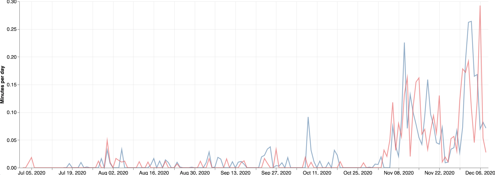

## Election interference coverage on cable TV 
### December 10, 2020

[Back to main page](https://hwsimpson33.github.io/pres2020/)

Much ink has been spilled about disinformation, fake news, and foreign interference in the 2020 election. According to the [Interference 2020 tracker](https://interference2020.org/), a project by the Atlantic Council's Digital Forensics Research Lab, there were dozens of allegations of foreign interference in the 2020 election with varying levels of credibility and influence. Foreign interference has become a political topic, with Republican alleging that investigations of possible collusion between the 2016 Trump campaign and Russia were politically motivated and Democrats accusing Republicans of trying to tie Joe Biden to [China](https://www.politico.com/news/2020/09/01/trump-says-china-supporting-biden-407054) for political reasons. Disinformation itself has become a politicized topic, with articles on how Trump's campaign [benefited from spreading fake news](https://www.theguardian.com/us-news/2020/nov/10/donald-trump-us-election-misinformation-media) and [amplified](https://www.nbcnews.com/politics/2020-election/russians-have-no-need-spread-misinformation-trump-his-allies-are-n1246653) [Russian](https://www.washingtonpost.com/lifestyle/media/trump-doesnt-need-russian-trolls-to-spread-disinformation-the-mainstream-media-does-it-for-him/2020/10/06/9612d602-07da-11eb-9be6-cf25fb429f1a_story.html) [misinformation](https://www.cnn.com/2020/08/17/politics/trump-retweets-known-russian-disinformation-biden-derkach/index.html). In fact, Google Trends shows that the states with the most searches for "disinformation" and "election interference" tend to be blue states, with the District of Colombia dominating both searches. These tables show the states with the most Google searches for the terms "election interference" and "disinformation." The numbers on this table represent the relative popularity of the searches in each state. The state with the largest number of searches is set to 100 and the state with the fewest searches is set to zero.

<table style="border-collapse:collapse;" class=table_7838 border=2>
<caption><b>Data on searches from Google Trends. Covers Nov. 1, 2018 - Dec. 9, 2020.</b></caption>
<thead>
<tr>
  <th id="tableHTML_header_1">State</th>
  <th id="tableHTML_header_2">Election interference</th>
</tr>
</thead>
<tbody>
<tr>
  <td id="tableHTML_column_1">District of Columbia</td>
  <td id="tableHTML_column_2">100</td>
</tr>
<tr>
  <td id="tableHTML_column_1">Vermont</td>
  <td id="tableHTML_column_2">32</td>
</tr>
<tr>
  <td id="tableHTML_column_1">Kansas</td>
  <td id="tableHTML_column_2">27</td>
</tr>
<tr>
  <td id="tableHTML_column_1">Oregon</td>
  <td id="tableHTML_column_2">26</td>
</tr>
<tr>
  <td id="tableHTML_column_1">Rhode Island</td>
  <td id="tableHTML_column_2">24</td>
</tr>
<tr>
  <td id="tableHTML_column_1">Maryland</td>
  <td id="tableHTML_column_2">23</td>
</tr>
</tbody>
</table>

<table style="border-collapse:collapse;" class=table_6071 border=2>
<thead>
<tr>
  <th id="tableHTML_header_1">State</th>
  <th id="tableHTML_header_2">Disinformation</th>
</tr>
</thead>
<tbody>
<tr>
  <td id="tableHTML_column_1">District of Columbia</td>
  <td id="tableHTML_column_2">100</td>
</tr>
<tr>
  <td id="tableHTML_column_1">Maine</td>
  <td id="tableHTML_column_2">21</td>
</tr>
<tr>
  <td id="tableHTML_column_1">Montana</td>
  <td id="tableHTML_column_2">21</td>
</tr>
<tr>
  <td id="tableHTML_column_1">Maryland</td>
  <td id="tableHTML_column_2">21</td>
</tr>
<tr>
  <td id="tableHTML_column_1">Vermont</td>
  <td id="tableHTML_column_2">20</td>
</tr>
<tr>
  <td id="tableHTML_column_1">Virginia</td>
  <td id="tableHTML_column_2">20</td>
</tr>
</tbody>
</table>

Quantitatively studying whether Republican or Democratic outlets spread more "fake news" would be difficult and time consuming. Instead, I decided to explore whether MSNBC and Fox News covered allegations of foreign interference differently. Using the Stanford Cable TV News Analyzer, I examined the following hypotheses: 

1. Fox spent less time covering election interference allegations than MSNBC.
2. Fox spent more time covering allegations about China and less time covering allegations about Russia than MSNBC.
3. Fox spent more time covering allegations of electoral fraud than MSNBC.

It's important to remember that the Stanford Cable TV News Analyzer only counts the number of occurrences of a term, not the context in which it was covered or the message viewers took away. If the amount of coverage is the same, that does not mean that the content or the effect was the same!

In order to test the first three hypotheses, I ran t-tests on the logged amount of time Fox and MSNBC spent on the terms "election" and "interfere," "election" and "Russia," "election" and "China," and "election" and "fraud." The data covers the period from November 1, 2018 to November 7, 2020 (when Joe Biden declared victory), with the exception of the election fraud dataset, which I limited to July 1, 2020 - December 8, 2020 in order to avoid mentions of election fraud in other countries and include the discussion on fraud since the election occurred.

The only t-test to give significant results was the first one:

1. Fox did spent less time covering election interference allegations than MSNBC, p = 0.02.
2. There is no evidence that Fox spent more time covering allegations about China and less time covering allegations about Russia than MSNBC. 
3. There is no evidence that Fox spent more time covering allegations of electoral fraud than MSNBC.

Because I used logged means for the t-test in order to normalize the data, the test means are not easy to interpret. Instead, these line graphs show how coverage by Fox and MSNBC coverage has changed over time:

<caption><b>Mentions of "election" and "interfere." Red is Fox, blue is MSNBC </b></caption>

[Click here to see full-size image.](https://hwsimpson33.github.io/pres2020/images/interfere_stanford_graph.png)

MSNBC almost always gives more coverage to stories involving election interference, as the t-test above demonstrated

But the graphs on discussion of Russia and China show no such pattern.

<caption><b>Mentions of "election" and "Russia." Red is Fox, blue is MSNBC </b></caption>

[Click here to see full-size image.](https://hwsimpson33.github.io/pres2020/images/russia_stanford_graph.png)

<caption><b>Mentions of "election" and "China." Red is Fox, blue is MSNBC </b></caption>

[Click here to see full-size image.](https://hwsimpson33.github.io/pres2020/images/china_stanford_graph.png)

The most striking graph is this one, on mentions of "fraud." Although beliefs on whether electoral fraud occurred [differ by political party](https://morningconsult.com/form/tracking-voter-trust-in-elections/), the _amount_ of coverage each incident provokes is almost identical. Again, the _content_ of those discussions is almost certainly different, but the left is just as obsessed with talking about fraud as the right.

<caption><b>Mentions of "election" and "fraud." Red is Fox, blue is MSNBC </b></caption>

[Click here to see full-size image.](https://hwsimpson33.github.io/pres2020/images/fraud_stanford_graph.png)

These results are in some ways encouraging. Fox and MSNBC might be presenting different spins on election interference, but at least they're both reporting on it in more or less equal amounts. In a time of information polarization, that's something. 

[Back to main page](https://hwsimpson33.github.io/pres2020/)
