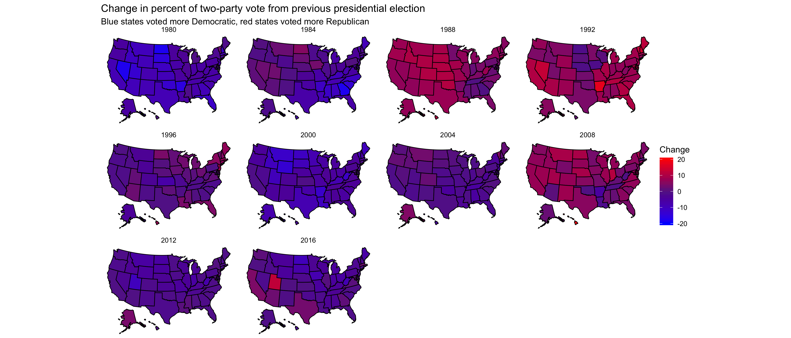
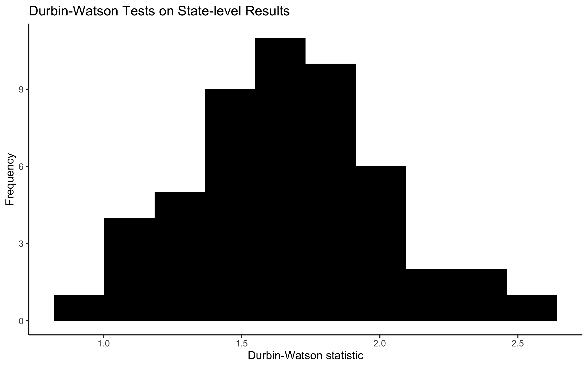

## Understanding polarization through serial correlation
### September 13, 2020

[Back to main page](https://hwsimpson33.github.io/pres2020/)

This week, I decided to do Extension 3:

[Click here to see full-size image](https://hwsimpson33.github.io/pres2020/images/extension3.png)

This graphic, as well as the 538 swing state graphic replication from section, inspired me to think more carefully about what causes swings in voting share in a particular state from election to election. I decided to ask a basic question: is the fluctuation in state-level vote random? We talk a lot about which states have become safe or swing states, assuming that changes from election to election in state-level voting patterns are driven by political events and not random chance. As a preliminary check, I decided to explore this hypothesis.

First, I plotted state-level results against results from the previous election. Inspired by _The Gamble_ Chapter 7 (p. 191), I made this graph:

[Click here to see full-size image](https://hwsimpson33.github.io/pres2020/images/across_elections.png)

A few observations jumped out at me right away. First, most points are clustered around the 45&deg; line, which means that the previous election's result does give you information about the likely result in this election. Second, it seems like recent elections (red dots) are closer to the line than older elections (grey dots). If states that voted very Republican in the last election are increasingly likely to vote very Republican in this election, this result could indicate that political polarization has increased. The rest of this blog post is devoted to exploring these two questions.

This graph shows only shows the correlation between two consecutive election results. But what about patterns in the whole time series? First, I plotted [a trendline for each state](../images/state_reg_plot.png) relating year to Republican share of two-party vote. The slopes of these lines range from significantly positive to zero to significantly negative. Then, I ran a statistical test of autocorrelation in residuals, the Durbin-Watson test. [As I understand it](http://www.columbia.edu/~so33/SusDev/Lecture_8.pdf), this test tells you whether positive and negative residuals are randomly distributed or whether a positive residual is unusually likely to be followed by another positive or a negative residual. I wanted to test whether results in each state exhibit positive autocorrelation (a self-reinforcing trend) or negative autocorrelation (reversion to the mean) over multiple elections. In order to do this, you would need to plot the mean as a straight line and calculate the residuals relative to this line (i.e. run a regression with only a constant on the right-hand side). The Durbin-Watson function in R wouldn't let me do this, however, so I had to use the trendlines I mentioned above. Therefore, the test results don't tell you about the overall relationship of the points to each other (for example, a strong Republican trend is captured by the trendline, not by the residuals of the trendline) but rather about their ordering -- are all of unusually high points grouped together, or are they spread out over the time series?

[Here are](../images/dwtest_table.png) the full results of the Durbin-Watson tests. Below is a histogram of the Durbin-Watson test statistics. A value between zero and two indicates positive autocorrelation, with values closer to zero indicating strongly positive autocorrelation. Values between two and four indicate negative autocorrelation. Seven states (out of the fifty states plus DC) have significant results at the 0.05 level, all of which demonstrate positive autocorrelation.

[Click here to see full-size image](https://hwsimpson33.github.io/pres2020/images/autocorr.png)

The histogram indicates a range of results, and it is important to keep in mind that with such a small dataset the test is not very powerful. However, I think it is fair to say that many states have a tendency towards positive autocorrelation of residuals relative to the trendline. This indicates that states that vote unusually Republican (relative to the trend) tend to remain unusually Republican in the next election. Notably, the seven states that show negative autocorrelation are all in the South and Midwest. This result could be driven by the large fluctuation in Republican vote share that accompanied the political realignment in the 1960s. Hopefully, I will be able to explore this question more thoroughly in the future. The question of autocorrelation gets to the core of the common idea that presidential elections regularly switch back and forth between parties, but the test as formulated here does not satisfactorily address that hypothesis.

Finally, I was curious whether the variation from year to year in election results has declined over time. In the 538 replication graphs, I noticed that many states seem to settle on a certain value and stay very close to it, especially over the past few elections. In order to explore this, I plotted histograms of state-level Republican share of two-party support in every election:

[Click here to see full-size image](https://hwsimpson33.github.io/pres2020/images/density_by_year.png)

There is a definite shift in the shape of these histograms, from a sharp peak around 50% until about 1988 that is replaced by an increasingly flattened curve in the 1990s and 2000s. Interestingly, two separate bumps start to emerge in 2004, 2008, and 2012, which is what one would expect to see if narratives about the emergence of "safe" Republican and Democratic states are accurate.

[Back to main page](https://hwsimpson33.github.io/pres2020/)
