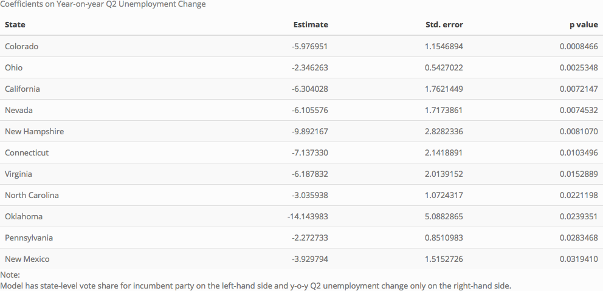
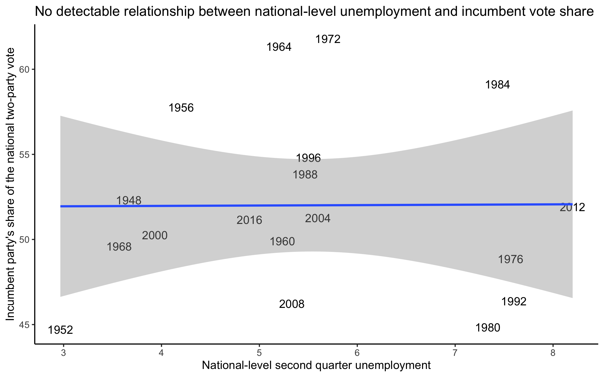
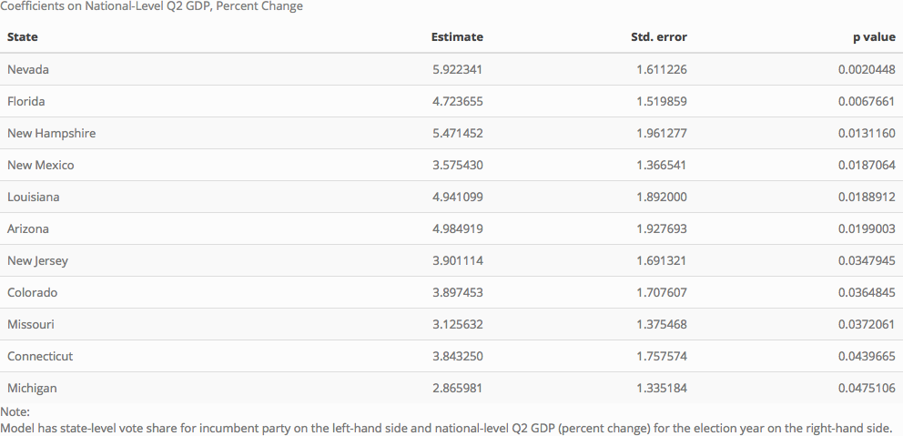

To be honest, I’m a little disappointed with the results of this week’s analysis. This is the week when we are supposed to begin building our prediction models using the most basic fundamental, the economy. I had a vision for the model I wanted to build: a multilevel model with both national- and state-level variables as predictors of state-level election results. This model makes sense to me because state-level election results are fundamental to US presidential elections. The election is fought state-by-state and strategic decision-making, campaigning, and media messaging effects should show up primarily on the state level. At the same time, the election is a national phenomenon and national-level conditions should also be included.

Unfortunately, the results of this week’s analysis do not bode well for the idea that state-level predictors should be an important part of my model. I was unable to build a convincing model using state-level economic indicators (Extension 3). At the state level, we have to use unemployment as an economic indicator, because state-level GDP data only goes back to 1997. I started out by regressing state-level support for the incumbent party’s presidential candidate on Q2 unemployment during the election year. These results were not encouraging – not a single state had a significant coefficient. 

[Click here to see plots of the results](https://hwsimpson33.github.io/pres2020/images/state_raw_ec_plot.png)

Then I tried year-on-year change in unemployment. Perhaps the absolute level of unemployment is too messy an indicator, but change in unemployment shows whether the economy is improving or worsening. The results were better, but still not as strong as I had hoped: only eleven states had significant coefficients.

[Click here to see full=size table](https://hwsimpson33.github.io/pres2020/images/state_diff_ec_table.png)

[Click here to see plots of the results](https://hwsimpson33.github.io/pres2020/images/state_diff_ec_plot.png)

## Troubleshooting the model
In class, we easily replicated the well-known result that GDP can predict national-level popular vote. What is going wrong in the unemployment models? Does the relationship between the economy and voting break down at the state level? Or is unemployment just a bad way to capture the aspects of economic performance that voters react to? First, I decided to test the relationship between unemployment and national-level election outcomes. 

[Click here to see full-size image](https://hwsimpson33.github.io/pres2020/images/nat_unem_plot.png)

The regression line is practically flat and (of course) the coefficient is not statistically significant. This result supports the hypothesis that unemployment, unlike GDP, cannot be used to predict vote outcomes. 
Next, I decided to regress state-level election results on national-level GDP. This regression tests the effect of national-level economic conditions on voting in each state. Because national-level election results react strongly to GDP, we might expect that state-level election results (the component parts of the national-level popular vote) would show a similar relationship. This is not a given (because of the [ecological fallacy](https://en.wikipedia.org/wiki/Ecological_fallacy)) but if we can't detect this relationship it raises questions about whether state-level election results are the right level of analysis.

[Click here to see full-size table](https://hwsimpson33.github.io/pres2020/imagees/nat_state_ec_table.png)

[Click here to see plots of the results](https://hwsimpson33.github.io/pres2020/images/nat_state_ec_plot.png)

These results were also not as strong as I would have hoped. Again, only eleven states have significant coefficients. Notably, five states appear both in this table and the table from the year-on-year state-level unemployment regression above: Connecticut, Colorado, Nevada, New Hampshire, and New Mexico. Three of these states (Colorado, Nevada, New Hampshire) are on [FiveThirtyEight’s list of swing states](https://en.wikipedia.org/wiki/Swing_state), so it makes sense that they would be unusually sensitive to both national- and state-level economic conditions. Other swing states from FiveThirtyEight make one list or the other (Ohio, Virginia, North Carolina, Pennsylvania, Florida, Michigan) or neither list (Iowa, Minnesota, Wisconsin). In general, these results indicate that swing states might be sensitive to economic conditions, but most other states are not sensitive enough to economic conditions to give a statistically significant result.

Perhaps this result indicates that state-level election results are more responsive to other factors (partisanship, campaigning) than the economy. But it is more likely that the sample size is so small that OLS is not powerful enough to give significant results, we aren't controlling for other important factors, or we don't have the right economic measures. I plan to keep exploring this problem in future weeks.

### Update
It looks like it should be possible to get state-level household income statistics going back to 1962. I'll look into this and add updates here if I find anything interesting.
