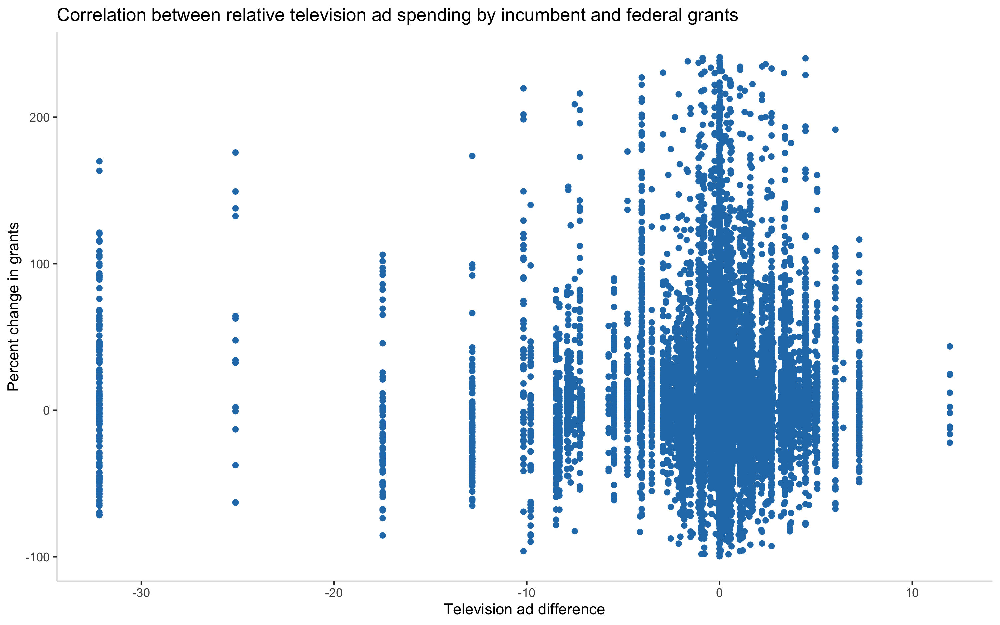

## titletitle
### date

[Back to main page](https://hwsimpson33.github.io/pres2020/)

This week, we read a [2012 paper by political scientists Douglas Kriner and Andrew Reeves, “The Influence of Federal Spending on Presidential Elections.”](https://www.jstor.org/stable/41495082?seq=1) This paper argues that federal grants spending has a statistically significant impact on the results of presidential elections at the county level. Kriner and Reeves use change in vote share instead of raw vote share in order to address the problem of endogeneity: you can’t use changes in grant spending to predict something that might affect changes in grant spending. They assume that presidents’ expectations of changes in vote share in the next election will not affect their grant spending decisions for the year prior to the election, a reasonable assumption. 

They are not interested in exploring whether "presidents may endeavor to reward loyal constituencies and target funds toward swing places, while largely ignoring communities that voted heavily against them.” This suggestion struck me as very plausible in our current political environment, with (certain) politicians openly making statements along these lines. 

If presidents are directing federal grant money strategically, they are likely directing it to the same locations where they direct their campaign resources.[^1] Are changes in federal grant spending correlated with the intensity of electioneering by the incumbent? I decided to use Kriner and Reeves’s replication data to explore this question.

First, I visually explored the correlation between change in federal grant spending in the year before the election and the differential in state-level TV advertising. 

[Click here to see full-size image.](https://hwsimpson33.github.io/pres2020/images/ad_grant_plot.png)

The plot doesn’t look particularly promising, and the correlation is only 0.013. If the correlation were high, this would pose a problem for Kriner and Reeves’s model.

Next, I ran a series of regressions, shown in the table below. It is important to note that these regressions do not show causation. I have not even attempted to fully model grants, which would require including control variables known or suspected to influence changes in grant spending. I just have Kriner and Reeves’s dataset, so I have to make do with the variables they included in order to model vote patterns.

<table style="text-align:center"><caption><strong>Regressing Grants on Ad Spending</strong></caption>
<tr><td colspan="4" style="border-bottom: 1px solid black"></td></tr><tr><td style="text-align:left"></td><td colspan="3">Percent change in grants</td></tr>
<tr><td></td><td colspan="3" style="border-bottom: 1px solid black"></td></tr>
<tr><td style="text-align:left"></td><td>(1)</td><td>(2)</td><td>(3)</td></tr>
<tr><td colspan="4" style="border-bottom: 1px solid black"></td></tr><tr><td style="text-align:left">Television ad difference</td><td>0.134*</td><td>0.178**</td><td>0.127</td></tr>
<tr><td style="text-align:left"></td><td>(0.076)</td><td>(0.087)</td><td>(0.092)</td></tr>
<tr><td style="text-align:left"></td><td></td><td></td><td></td></tr>
<tr><td style="text-align:left">Change in two-party vote share of incumbent president</td><td></td><td>0.237***</td><td>0.164***</td></tr>
<tr><td style="text-align:left"></td><td></td><td>(0.043)</td><td>(0.045)</td></tr>
<tr><td style="text-align:left"></td><td></td><td></td><td></td></tr>
<tr><td style="text-align:left">Change in per capita income (in 1000s)</td><td></td><td>1.418***</td><td>1.528***</td></tr>
<tr><td style="text-align:left"></td><td></td><td>(0.197)</td><td>(0.199)</td></tr>
<tr><td style="text-align:left"></td><td></td><td></td><td></td></tr>
<tr><td style="text-align:left">Constant</td><td>10.268***</td><td>-3.467</td><td>-0.692</td></tr>
<tr><td style="text-align:left"></td><td>(0.294)</td><td>(2.394)</td><td>(3.195)</td></tr>
<tr><td style="text-align:left"></td><td></td><td></td><td></td></tr>
<tr><td colspan="4" style="border-bottom: 1px solid black"></td></tr><tr><td style="text-align:left">State fixed effects</td><td>No</td><td>No</td><td>Yes</td></tr>
<tr><td style="text-align:left">Observations</td><td>18,465</td><td>17,671</td><td>17,671</td></tr>
<tr><td style="text-align:left">R2</td><td>0.0002</td><td>0.005</td><td>0.017</td></tr>
<tr><td style="text-align:left">Adjusted R2</td><td>0.0001</td><td>0.005</td><td>0.014</td></tr>
<tr><td colspan="4" style="border-bottom: 1px solid black"></td></tr><tr><td style="text-align:left">notes</td><td colspan="3" style="text-align:right">*p<0.1; **p<0.05; ***p<0.01</td></tr>
</table>
length of NULL cannot be changedlength of NULL cannot be changedlength of NULL cannot be changedlength of NULL cannot be changedlength of NULL cannot be changednumber of rows of result is not a multiple of vector length (arg 2)number of rows of result is not a multiple of vector length (arg 2)
<table style="text-align:center"><caption><strong>Regressing Grants on Ad Spending and Campaign Appearances</strong></caption>
<tr><td colspan="4" style="border-bottom: 1px solid black"></td></tr><tr><td style="text-align:left"></td><td colspan="3">Percent change in grants</td></tr>
<tr><td></td><td colspan="3" style="border-bottom: 1px solid black"></td></tr>
<tr><td style="text-align:left"></td><td>(1)</td><td>(2)</td><td>(3)</td></tr>
<tr><td colspan="4" style="border-bottom: 1px solid black"></td></tr><tr><td style="text-align:left">Television ad difference</td><td>0.092</td><td>0.146</td><td>0.078</td></tr>
<tr><td style="text-align:left"></td><td>(0.078)</td><td>(0.089)</td><td>(0.094)</td></tr>
<tr><td style="text-align:left"></td><td></td><td></td><td></td></tr>
<tr><td style="text-align:left">Campaign appearance difference</td><td>0.224**</td><td>0.182</td><td>0.309**</td></tr>
<tr><td style="text-align:left"></td><td>(0.114)</td><td>(0.115)</td><td>(0.130)</td></tr>
<tr><td style="text-align:left"></td><td></td><td></td><td></td></tr>
<tr><td style="text-align:left">Change in two-party vote share of incumbent president</td><td></td><td>0.238***</td><td>0.167***</td></tr>
<tr><td style="text-align:left"></td><td></td><td>(0.043)</td><td>(0.045)</td></tr>
<tr><td style="text-align:left"></td><td></td><td></td><td></td></tr>
<tr><td style="text-align:left">Change in per capita income (in 1000s)</td><td></td><td>1.425***</td><td>1.537***</td></tr>
<tr><td style="text-align:left"></td><td></td><td>(0.197)</td><td>(0.199)</td></tr>
<tr><td style="text-align:left"></td><td></td><td></td><td></td></tr>
<tr><td style="text-align:left">Constant</td><td>10.272***</td><td>-3.502</td><td>-0.905</td></tr>
<tr><td style="text-align:left"></td><td>(0.294)</td><td>(2.394)</td><td>(3.196)</td></tr>
<tr><td style="text-align:left"></td><td></td><td></td><td></td></tr>
<tr><td colspan="4" style="border-bottom: 1px solid black"></td></tr><tr><td style="text-align:left">State fixed effects</td><td>No</td><td>No</td><td>Yes</td></tr>
<tr><td style="text-align:left">Observations</td><td>18,465</td><td>17,671</td><td>17,671</td></tr>
<tr><td style="text-align:left">R2</td><td>0.0004</td><td>0.005</td><td>0.017</td></tr>
<tr><td style="text-align:left">Adjusted R2</td><td>0.0003</td><td>0.005</td><td>0.015</td></tr>
<tr><td colspan="4" style="border-bottom: 1px solid black"></td></tr><tr><td style="text-align:left">notes</td><td colspan="3" style="text-align:right">*p<0.1; **p<0.05; ***p<0.01</td></tr>
</table>

Nevertheless, these results are interesting. The r2s are uniformly low, which is to be expected in a model that does not include important control variables. But the differentials in ad spending and campaigning both show a positive relationship with grant spending and they hover near significance. These results certainly do not provide a definitive answer to my question, but they indicate that further study may be warranted. 

More advanced models with more comprehensive data (perhaps extending before 1988 and after 2008) could examine the (likely non-linear) relationship between federal resources and campaign resources. Modeling this relationship would be an important contribution to the literature (if it hasn’t been done already) and, coincidentally, would help me conceptualize one of the problems I’m currently working on, the tradeoff between election fraud and ruling party mobilization in semi-competitive contexts like Russia.

[^1]: Although it is possible that incumbents use federal money as a substitute to campaign money rather than a complement, we’re not going to address that in this blog post.