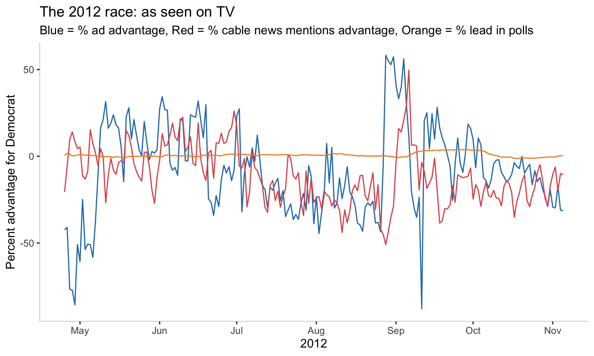

## Federal grants and presidential campaigns
### October 3, 2020

[Back to main page](https://hwsimpson33.github.io/pres2020/)

This week, our dataset focused on advertising in presidential campaigns. A few weeks ago, I discovered the [Stanford Cable TV News Analyzer](https://tvnews.stanford.edu/) and I wanted to use this tool to compare TV news mentions of candidates and advertising spending. Political ads are designed to persuade voters, as [Huber and Arceneaux (2007)](https://onlinelibrary.wiley.com/doi/abs/10.1111/j.1540-5907.2007.00291.x) argue. But perhaps they also drive the political conversation, pushing narratives that are then picked up by political talk shows and end up reflected in voters' opinions. On the other hand, ads might respond to themes that already exist in the political environment, trying to shift the conversation in a direction that is more favorable to their candidate. 

This research project would be interesting and (I believe) viable, but it would require either automatically querying the Stanford TV Cable News Analyzer or running over 150 searches by hand to match the ad topic categories in our dataset. Unfortunately, I did not have time to do either this week. Instead, I picked a simpler research question: what is the relationship between mentions of candidates' names on cable TV (measured as the number of seconds someone is saying their name on TV), candidate ad spending, and polling averages? I combined day-by-day time series of these variables for the 2012 race, the only election for which I have both cable news data and ad data, and transformed each into a measure of advantage for the Democratic candidate by finding the percentage of TV mentions/ ad spending for Obama out of the two-party total.

[Click here to see full-size image.](https://hwsimpson33.github.io/pres2020/images/time_plot.png)

Next, I 

<table style="border-collapse:collapse;" class=table_4430 border=1>
<thead>
<tr>
  <th id="tableHTML_header_1">order</th>
  <th id="tableHTML_header_2">p.value</th>
</tr>
</thead>
<tbody>
<tr>
  <td id="tableHTML_column_1">1</td>
  <td id="tableHTML_column_2">0.0402</td>
</tr>
<tr>
  <td id="tableHTML_column_1">2</td>
  <td id="tableHTML_column_2">4e-04</td>
</tr>
<tr>
  <td id="tableHTML_column_1">3</td>
  <td id="tableHTML_column_2">0.0052</td>
</tr>
<tr>
  <td id="tableHTML_column_1">4</td>
  <td id="tableHTML_column_2">0.0031</td>
</tr>
<tr>
  <td id="tableHTML_column_1">5</td>
  <td id="tableHTML_column_2">0.005</td>
</tr>
</tbody>
</table>