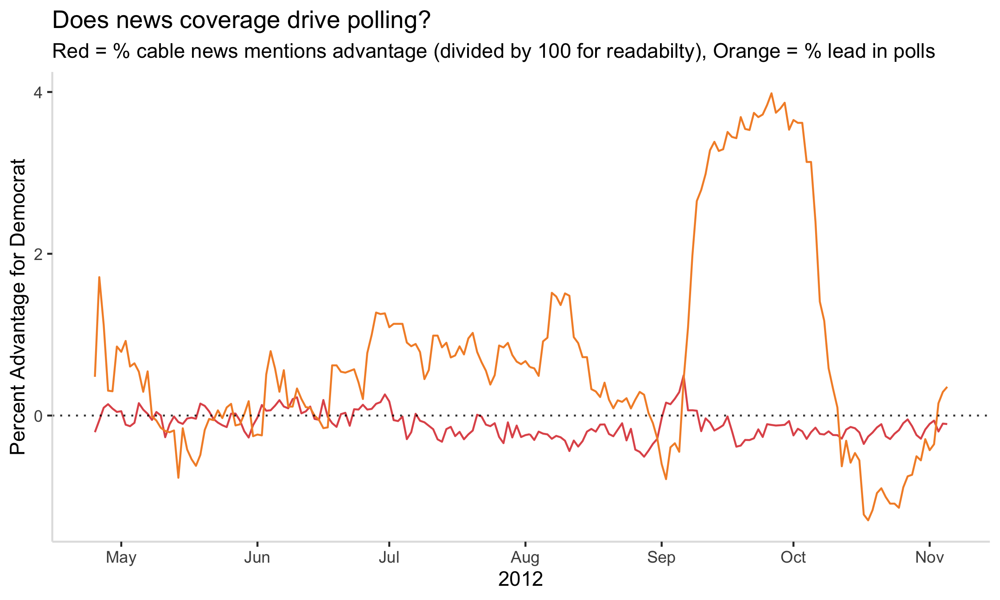

## Federal grants and presidential campaigns
### October 3, 2020

[Back to main page](https://hwsimpson33.github.io/pres2020/)

Our dataset of the week contains information on presidential advertising campaigns. A few weeks ago, I discovered the [Stanford Cable TV News Analyzer](https://tvnews.stanford.edu/), and I wanted to use this tool to compare TV news mentions of candidates and advertising spending. Political ads are designed to persuade voters, as [Huber and Arceneaux (2007)](https://onlinelibrary.wiley.com/doi/abs/10.1111/j.1540-5907.2007.00291.x) argue. But perhaps they also drive the political conversation, pushing narratives that are picked up by political talk shows and then reflected in voters' opinions. On the other hand, ads might respond to themes that already exist in the political environment, trying to shift the conversation in a direction that is more favorable to their candidate. 

This research project would be interesting and (I believe) viable, but it would require either automatically querying the Stanford TV Cable News Analyzer or running over 150 searches by hand to match the ad topic categories in our dataset. Unfortunately, I did not have time to do either this week. Instead, I picked a simpler research question: what is the relationship between mentions of candidates' names on cable TV (measured as the number of seconds during which someone is saying their name), candidate ad spending, and polling averages? I combined day-by-day time series of these variables for the 2012 race, the only election for which I have both cable news data and ad data, and transformed each into a measure of advantage for the Democratic candidate by finding the percentage of TV mentions and ad spending for Obama out of the two-party total.

[Click here to see full-size image.](https://hwsimpson33.github.io/pres2020/images/time_plot.png)

I started by calculating the correlation between each pair of variables. Ad advantage did not show much correlation to either poll lead or cable news advantage. Poll lead and cable news advantage, however, were significantly negatively correlated (correlation = -0.1523, p = .03357). This would suggest that Obama tends to be mentioned less on cable TV news relative to Romney when he is ahead in the polls. This result is suggestive, but does not take into account the time-series structure of the data. It treats each day as a single observation, and the observations are not ordered in relation to each other. 

Next, I ran a series of [Granger causality tests](https://en.wikipedia.org/wiki/Granger_causality) for each ordered pair of variables. Granger causality tests are used to determine if one time series can "predict" another, that is, if changes in time series x happen before changes in time series y. Granger tests cannot be used to show causality per se, because a third variable could be driving changes in both x and y, there is no way to control for other relevant variables, and the lagged correlation between the two variables could be spurious. The Granger test does show that there is some sort of relationship between the variables, however, and it is particularly useful in chicken-and-egg situations when causality could run in either direction (or both).

The only ordered pair of variables to show significant results was news advantage used to predict poll advantage. The results were significant at every lag order I tried (if I understand it right, when a time series is autocorrelated or not stationary, using higher-order lags allows you to correct for bias). According to [StackExchange], you should use AIC and/or BIC to pick between different lag orders, but I couldn't figure out how to calculate them, so several lags are shown below. All the lag orders I tried for this test were significant, however.

<table style="border-collapse:collapse;" class=table_6815 border=2>
<thead>
<tr>
  <th id="tableHTML_header_1">order</th>
  <th id="tableHTML_header_2">p.value</th>
</tr>
</thead>
<tbody>
<tr>
  <td id="tableHTML_column_1">1</td>
  <td id="tableHTML_column_2">0.0097</td>
</tr>
<tr>
  <td id="tableHTML_column_1">2</td>
  <td id="tableHTML_column_2">0.0017</td>
</tr>
<tr>
  <td id="tableHTML_column_1">3</td>
  <td id="tableHTML_column_2">0.0135</td>
</tr>
<tr>
  <td id="tableHTML_column_1">4</td>
  <td id="tableHTML_column_2">0.005</td>
</tr>
<tr>
  <td id="tableHTML_column_1">5</td>
  <td id="tableHTML_column_2">0.0085</td>
</tr>
</tbody>
</table>

Using poll advantage to predict news advantage did not produce significant results, however. These results suggest that the candidate who got more news coverage during the 2012 campaign then did better in the polls soon afterwards, a reasonable result. Ads did not have a significant impact on either news coverage or polling. 

Another interesting result I discovered while preparing to run the Granger tests was that [all] x [three] z [time] series have highly negatively (significantly) autocorrelated residuals, meaning that they exhibit reversion to the mean (see my [Week 1] blog post). This is an interesting observation in its own right. Is there some process that drives polls, ad spending, and news mentions to be negative for a candidate one day and positive the next day? Although I do not believe this impacts the results of higher-order Granger tests, I am also not confident enough in my understanding of Granger tests to be sure!

Finally, I decided to take a closer look at the raw data on poll advantage and TV news advantage. There are a few interesting observations to be made about this graph. First, the massive surge in Obama's poll numbers in September seems to correspond to the convention bump that [Sides and Vavreck] describe in our reading from several weeks ago. This bump is preceded by a sharp increase in coverage, but the coverage goes back down much faster than poll numbers do. Second, Obama actually receives less coverage than Romney for most of the campaign – despite (or because of?) his higher poll numbers (the dashed line at y = zero represents equal coverage for challenger and incumbent). Incumbency could also be a factor in news coverage. Incumbents probably get more coverage than challengers earlier in the campaign because they are in the news before the campaign even starts (in fact, there is [evidence for that pattern] in my dataset). That pattern could reverse itself during the campaign itself, however, if the incumbent is a "known quantity" and the relatively new challenger is a more interesting topic for pundits to discuss.

[Click here to see full-size image.](https://hwsimpson33.github.io/pres2020/images/poll_news_time_plot.png)

There are lots of other angles to explore on this project. In addition to my original idea (testing each advertising topic against news for that topic), it would also be interesting to test the candidates separately, see if the cable news and polling pattern holds in 2016 (there is no ad data for 2016, but we do have both polling and news data), and explore cumulative measures of ad spending and news coverage as well as absolute measures. I hope I will have the opportunity to explore some of these questions in future weeks. 

