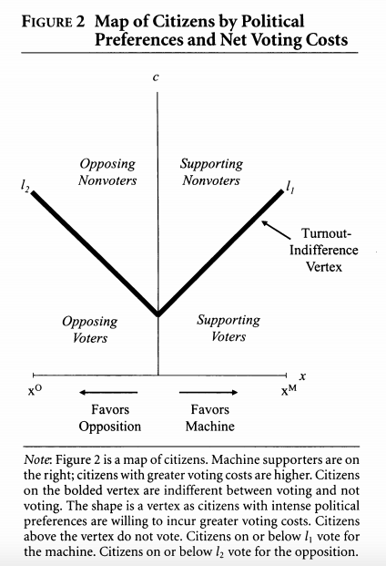
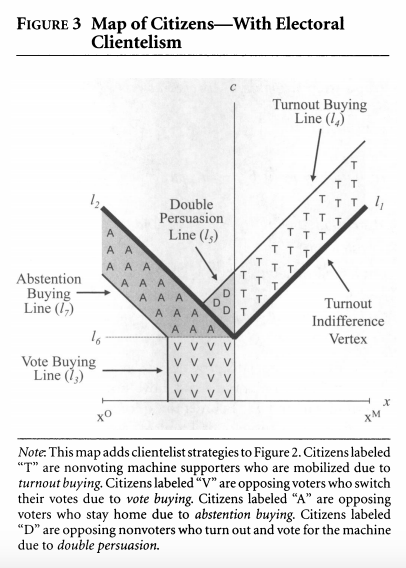

## As seen on TV: ads, cable news, and polling during the 2012 presidential race
### October 10, 2020

[Back to main page](https://hwsimpson33.github.io/pres2020/)

This week I want to explore campaign strategy based on this prompt: 
>Let’s say a field office costs \$21,000 and 1 GRP buy [TV ad buy] is \$300. If you are a campaign manager for Biden or Trump with a fixed budget, where would you build or air and how much? What is the ground game strategy for Trump and Biden in 2020 in the middle of pandemic?

Rather than starting with literature from American political science on the effectiveness of field offices and ad buys, I want to start with a theoretical paper from comparative politics: Jordan Gans-Morse, Sebastian Muzzuca, and Simeon Nichter's 2014 paper ["Varieties of Clientelism: Machine Politics during Elections."] This paper is not about American elections or even democratic elections – it's about clientelist strategies used by political machines in hybrid regimes. Although it uses terms like "vote buying" and "turnout buying," I believe the strategies described translate relatively well to US elections. 
Gans-Morse et al. describe four types of strategies: vote buying, turnout buying, abstention buying, and double persuasion (convincing someone both to vote and to vote for your candidate). Machines use all four strategies, they argue. But each strategy is targeted at a different population, and the optimal mix of strategies is determined by structural factors.

This figure shows how they model voter choice. If each point represents a voter, the x-axis shows that voter's position on the ideological spectrum and the y-axis is the voter's "cost" of voting. Voters with high costs and weak ideological preferences do not turn out to vote, but voters with low costs and/or strong preferences will vote without any external inducement.

This figure presents the results of their formal model. Political machines, they argue, will target supporters for turnout mobilization, low-cost weak-preference opposition voters (who will almost certainly turn out and are relatively cheap to convince) for vote buying, high-cost opposition voters for abstention buying (it is cheaper to convince these voters to stay at home than to change their preferences), and a small slice of middle-cost weak-preference voters for double persuasion, the most expensive strategy. This strategy enables a campaign to buy the best results for the least amount of money.

This model contains several insights about the tradeoff between field offices and ad buys in American campaigns. Research in American political science shows that ads persuade voters rather than motivating turnout [papers from last week]. Campaign field offices ("ground game"), however, have been proven to be effective at driving turnout [paper 1], but are not well organized for persuading opposition voters [Enos paper]. In the terms of Gans-Morse et al., some advertisements (particularly positive ads) correspond to vote buying and others (negative ads) correspond to abstention buying. Both of these strategies are targeted at opposition voters. Field offices, on the other hand, are good for turnout buying (mobilizing supporters) and double persuasion (when used in concert with persuasive/ positive advertising). Rather than treating the tradeoff between ads and field offices as a strategic choice within a uniform population, then, Gans-Morse et al. suggest that these strategies target different populations. These populations may overlap geographically, but if the Gans-Morse el al. model is applicable then we should see advertising and field offices targeted at different types of voters. 

Gans-Morse et al. also present comparative statics on their model. Holding all else equal, they argue that this diagram represents the result of a shift to reduced salience of partisan preferences. In other words, if voters care less about who wins, the difference in turnout between highly partisan and indifferent voters decreases. There are proportionately more undecided voters willing to turn out, however. Gans-Morse et al. argue that this shift reduces the amount of turnout buying, abstention buying, and double persuasion. It increases the number of cheap, persuadable voters, however, who can be enticed using vote buying. In the American context, this shift translates to a reduction in partisanship, i.e. weaker partisan convictions among voters and less distance between party policy platforms. Holding everything else equal, then, making an American state less partisan should lead to an increase in persuasive ad buying.

We can finally turn to modeling the tradeoff between ad buying and field offices in the US. Let's assume that presidential candidates are only considering their chances of winning the race when choosing where to locate their field offices (in reality, [they also consider] (cite paper 1) downballot races and laying the groundwork for future campaigns). They should focus their efforts on battleground states and states with a large number of electoral votes. The total budget for each state should be proportional to the product of the current expected win/ loss margin (the difference from 50%) and the number of electoral votes in a state. Determining the total budget for a state, however, should happen independently of deciding how to allocate it within the state.

This allocation depends on the partisan makeup of the state. In highly polarized environments, persuasion is more expensive, so candidates should focus on turnout and abstention buying (and, to some extent, double persuasion). This means we should expect them to focus on building field offices and running negative ads or [other tricks to dissuade the opposition from voting] (CA republicans). More sophisticated campaigns will be able to identify and target voters who can be convinced to turnout and to support their candidate, although this may require combining the persuasive power of advertising with the turnout-boosting effects of canvassing. In less polarized environments, however, campaigns should focus more on vote buying, or using positive ads to convince persuadable voters to switch sides. This result makes intuitive sense, because negative advertising is often associated with high levels of polarization in popular discourse. 

These hypotheses could easily be tested with the right data. This is how I would set up my models: 

% negative ads out of all ads = state expected vote margin * # of electoral votes + % voters registered to parties (to measure polarization) + demographic controls for the effectiveness of ads

number of offices in a state = state expected vote margin * # of electoral votes + % voters registered to parties + demographic controls for the effectiveness of offices

The extent of a state's "battleground" nature should be controlled for by interacting the expected vote margin (perhaps measured by early polling) and the number of electoral votes. Demographic controls (most notably for urbanization) should take care of small variations in campaign effectiveness across states. And, if this model is correct, we should expect to find a positive and significant coefficient on our proxy for polarization in both equations.

Unfortunately, I don't have data on on the percentage of voters registered to the parties, and I didn't have time this week to collect and clean it (I don't want to use previous vote results because these likely go into the expected vote margin for the state). I hope to have time to follow up on this in future weeks. In the meantime, what are the implications of this theory on predicting election results? To the extent that (campaigns matter at all) [paper 4], forecasters should pay attention to turnout as well as partisan preferences. If much of the campaign activity is being directed towards increasing or decreasing turnout, voting intentions may be the real battlefield on which campaigns play out.  

[Back to main page](https://hwsimpson33.github.io/pres2020/)
