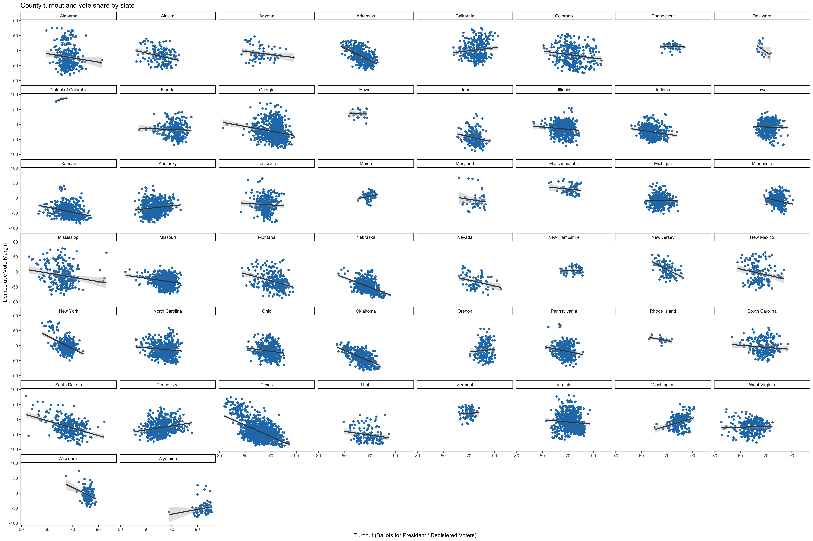

## How to buy votes: Lessons from clientelism on US campaign strategies
### October 17, 2020

[Back to main page](https://hwsimpson33.github.io/pres2020/)

This week, I decided to explore the relationship between turnout and vote share. If we want to predict the effect of COVID-19 on vote share (who wins the election) and we believe that COVID-19 will affect turnout (as is hypothesized in the first suggested extension), then we need to understand the relationship between turnout and vote share.

I have often heard assertions like "higher turnout benefits Democrats" being thrown around, but this statement can only be true in the aggregate. Higher turnout among Democrats (in predominantly Democratic areas) benefits Democratic candidates, but higher turnout among Republicans (in predominantly Republican areas) benefits Republicans. So the question is not whether turnout is "high" or "low," but _whose_ turnout is higher. 

In fact, in a highly polarized environment, the battle over turnout is likely to be more important than competition for votes. If voters have strong preferences and ads have weak persuasive effects, then it will cost a lot to "buy" a voter, i.e. to convince an opposition voter to change his mind. Turnout and abstention buying -- encouraging your own partisans to turn out and discouraging the other side -- will be relatively cheaper (for more on this topic, including a reference to a formal model, see my [blog post from last week](week6.md). 

Finally, in my past study of Russian elections, I have occasionally come across regressions of vote share on turnout. This was explored by students of Russian elections (mainly Russian physicists, statisticians, and bloggers) as a technique for detecting electoral fraud. The theory goes that high turnout should benefit all candidates equally, so if some polling stations have both unusually high turnout and unusually high support for Putin, this pattern could indicate that pro-Putin ballots were fraudulently added, raising both turnout and Putin's vote share. Unfortunately, this theory relies on the very strong assumption that all other conditions are equal between polling stations, which is not generally met. This technique was mostly abandoned when Russian bloggers discovered similar patterns in non-fraudulent democracies like the US and Germany. For the past several years, I've been wondering what causes these patterns (partisan mobilization?) and what they can tell us about democratic elections.

*Turnout (x-axis) and vote share (y-axis) in Moscow from the 2011 Duma (Russian legislature) election. Blue corresponds to United Russia, the ruling party. [Source](https://akarlin.com/2011/12/measuring-churovs-beard/)*

I wanted to find out: (1) is there a relationship between turnout and vote share? (2) how does this relationship vary across states? and (3) could this relationship be explained by controlling for other variables like previous vote, demographics, and campaigns? I decided to collect county-level turnout data in order to answer these questions.[^1]

First, I plotted the county-level relationship between turnout (percent of registered voters who cast a ballot in the presidential race) and vote share at the national level. In counties where Democratic presidential candidates "won" (i.e. got more than 50% of the vote), turnout is _negatively_ and significantly associated with democratic vote margin (coefficient = -0.24, p value = 0.000). For each additional point of turnout, Democrats lose about 0.24 points relative to Republicans. In Republican-voting counties, however, turnout is slightly _positively_ associated with vote margin (coefficient on Democratic vote margin = -0.04, p value = 0.091), a result that is significant at the p < 0.1 level.

[Click here to see full-size Democratic image.](https://hwsimpson33.github.io/pres2020/images/turnout_vote_dplot.png)
[Click here to see full-size Republican image.](https://hwsimpson33.github.io/pres2020/images/turnout_vote_rplot.png)

Next, I plotted the same relationship at the state level (aggregated across parties). Out of the 50 states and Washington, DC, 11 states showed a positive relationship between turnout and Democratic vote margin (CA, DC, KY, ME, NH, OR, TN, VT, WA, WV and WY). Thirty-three states had signficant coefficients on turnout at the p < 0.05 level.

[Click here to see full-size image.](https://hwsimpson33.github.io/pres2020/images/state_turnout_vote_plot.png)

Finally, I built a series of models with county-and state-level covariates to explore whether turnout is acting as a proxy for other variables or adds explanatory power of its own. These models use county-level observations and are pooled at the state-level. I started by adding county-level demographic variables (percent White and percent over 65) as well as year fixed effects and a lagged variable for the previous election's vote share in each county. Twenty-eight states still showed a significant relationship for turnout. Then, I added state-level polls (an average of polls taken less than thirty days before the election) and an economic indicator(year-on-year Q2 difference in unemployment).[^2] Both variables increased the predictive performance of the model (the r2) and reduced the number of states with a significant turnout variable to 19. Finally, I added data on campaigning, including relative ad spending by state - excluding 2016 - and relative field offices by county. Controlling for field offices at the county level still left 17 states with significant coefficients on turnout. This model also produced state-level regressions with very high r2. 

Adding the field offices variable was particularly challenging because we only have county-level data for both parties for 2012. Rather than try to piece together several different datasets, I opted to restrict my analysis on field offices to just 2012. Even with several states excluded because of missing data, I still found 13 states with significant coefficients on turnout using this specification. 

[histogram]

The results of these models were a little bit difficult to interpret and present, not least because there are so many of them (each specification produced 50 regressions!). First, my control variables (county-level demographics, previous county vote share, state-level unemployment and polling as well as advertising advantage) did not fully capture the effect of turnout on vote share. Something not described by these control variables is going on, because 13 states still have significant coefficients on turnout. Second, this model produces good county-level predictions with uniformly high r2. I am considering using this type of disaggregated model for my final prediction next week. Finally, working with the full dataset is difficult because of missingness. If I do use this approach next week, I will need to come up with more ways to impute data where possible.

Significance for this election: COVID + turnout mobilization/ demobilization campaigns in this election. We won't know turnout before the election although we might be able to guess based on early voting. But high predictibility of county-level results is a good sign - relatively stable relationship b/t turnout + vote share will dampen the effects of unpredictibility this year. And -- it's not just Russia. The turnout-vote share relationship is capturing something in the US too. Question for comparativists: does this really reflect mobilizaiton? how does it change across electoral systems?

[^1]: It is important to use data that is as disaggregated as possible, because many of these patterns change or disappear at higher levels of aggregation (see [Simpson's paradox](https://en.wikipedia.org/wiki/Simpson%27s_paradox#:~:text=Simpson's%20paradox%2C%20which%20also%20goes,when%20these%20groups%20are%20combined.)).
[^2]: As I discovered in [my second blog post](week2.md), unemployment is not a very good predictor for elections. But it's the only one I have at a state level right now (I haven't been able to get state-level historical real income, although I know the data exist).